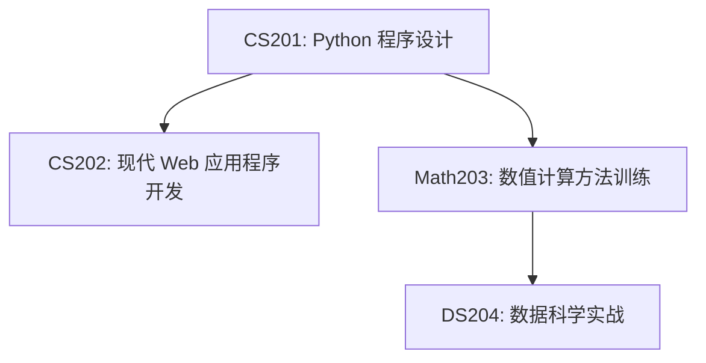

# 信计大作业课程安排

上海电力大学数理学院信息与计算科学大作业课程安排路径图

1. CS202: 使用 Python 作为 Web 应用程序的后端开发编程语言，使用Python的 `FastAPI` 这个库，以及 `MySQL` 作为关系型数据库存储数据，前端开发用到的技术栈为`HTML/CSS/JavaScript/React.js/TailwindCSS`。
2. Math203: 使用 Python 进行数值计算，通过计算机来求解微分方程、积分方程、Ax=b等问题。会使用到 Python 的 `Numpy、Matplotlib、Scipy` 这三个库。
3. DS204: 使用 Python 进行数据科学和机器学习算法应用，会使用到 Python 的 `Numpy、Matplotlib、scikit-learn、Pytorch` 等常用的数据科学与机器学习的库。

可以看到 Python 的生态非常庞大，涵盖了Web开发、数值计算、机器学习、爬虫等等领域，并且也是信计专业后续几门大作业课程的基础，因此同学们需要把 Python 学好，为后续的深入学习打下坚实的基础。