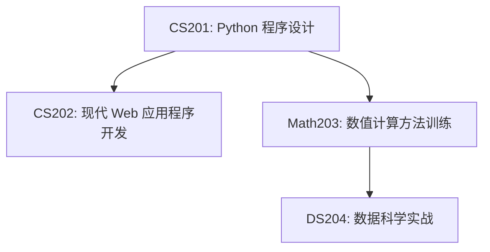

# 信计大作业课程安排

上海电力大学数理学院信息与计算科学大作业课程安排图例

```mermaid
graph
	A[CS201: Python 程序设计] --> B[CS202: 现代 Web 应用程序开发]
	A --> C[Math203: 数值计算方法训练]
	C --> D[DS204: 数据科学实战]

```

可以看到 Python 是信计专业后续几门大作业课程的基础，因此同学们需要好好的把 Python 学好。