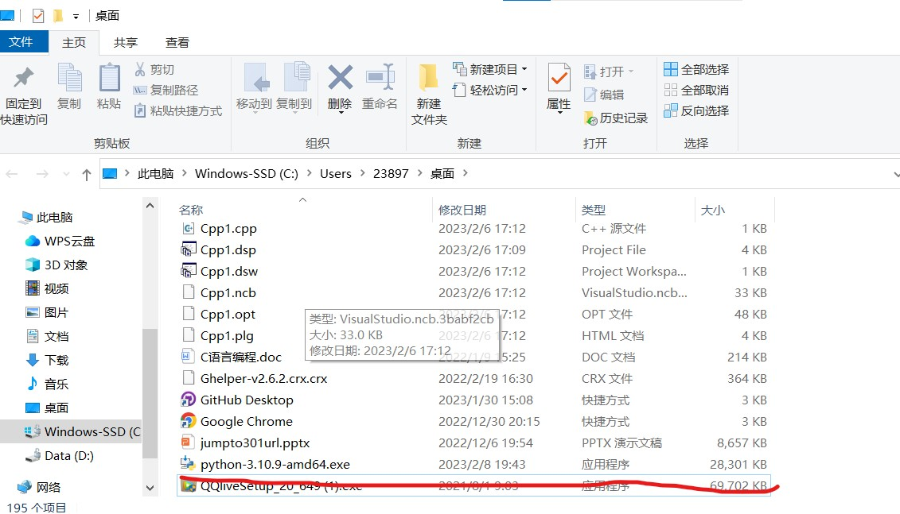
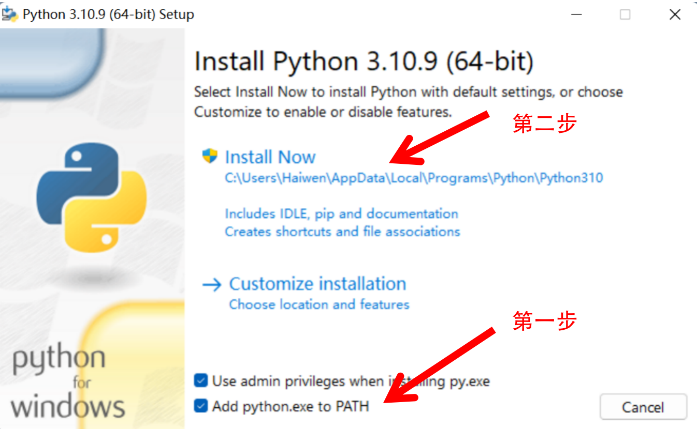
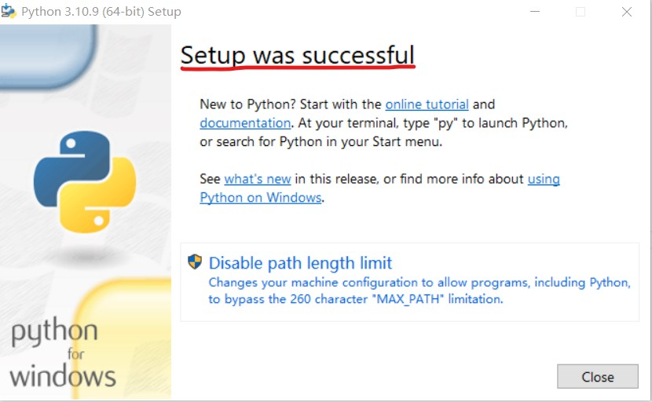
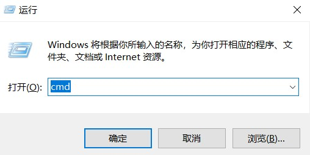

# Windows 安装

:::caution

*非常重要，请仔细阅读完本文以后再进行相关操作。（因未仔细阅读完本文，出现任何错误后果自负， 逃～～～逃～～～逃*

:::


## 第一种安装方式

**强烈推荐第一种安装方式**

### 为什么使用Scoop

在 Windows 下，搭建开发环境一直是一个复杂且困难的问题。由于没有一个统一的标准，导致各种开发环境的安装方式差异巨大，需要付出很多不必要的时间成本。而 Scoop 可以帮助你统一安装并管理常见的开发软件，省去了手动下载安装，配置环境变量等繁琐步骤。

例如安装 python 和 nodejs 只需要执行：

```bash
scoop install python
scoop install nodejs
```

### 安装 Scoop

Scoop 需要 [Windows PowerShell 5.1](https://aka.ms/wmf5download) 或者 [PowerShell](https://aka.ms/powershell) 作为运行环境，如果你使用的是 Windows 10 及以上版本，Windows PowerShell 是内置在系统中的。而 Windows 7 内置的 Windows PowerShell 版本过于陈旧，你需要手动安装新版本的 PowerShell。

:::tips

由于发现很多同学在设置 Windows 用户时使用了中文用户名，导致了用户目录也变成了中文名。如果按照 Scoop 的默认方式将软件安装到用户目录下，可能会造成部分软件执行错误。所以这里推荐安装到自定义目录，如果需要其他安装方式请参考： [ScoopInstaller/Install](https://github.com/ScoopInstaller/Install)

:::

- 设置 PowerShell 执行策略

```bash
Set-ExecutionPolicy -ExecutionPolicy RemoteSigned -Scope CurrentUser
```
- 下载安装脚本

```bash
irm get.scoop.sh -outfile 'install.ps1'
```
- 执行安装, --ScoopDir 参数指定 Scoop 安装路径

```bash
.\install.ps1 -ScoopDir 'C:\Scoop'
```

### Scoop
Scoop 的官方文档对于新手非常友好，相对于在此处赘述更推荐阅读
[快速入门](https://github.com/ScoopInstaller/Scoop/wiki/Quick-Start)。


### 安装 Python

- 安装基础依赖 (7zip, git, aria2)

```bash
 scoop install https://cdn.jsdelivr.net/gh/duzyn/scoop-cn/bucket/7zip.json
```

```bash
 scoop install https://cdn.jsdelivr.net/gh/duzyn/scoop-cn/bucket/git.json
```

```bash
 scoop install https://cdn.jsdelivr.net/gh/duzyn/scoop-cn/bucket/aria2.json
```

- 安装 Python
  
```bash
scoop install python
```


## 第二种安装方式

## 下载安装包

Python官网地址为:https://www.python.org/

1.进入首页点击"Downloads"，然后点击"windows"


2.选择"Python 3.10.9"这一版本进行下载


:::danger
本课程Windows上的Python版本为3.10.9，请不要下错版本。
:::

### 安装Python
1.找到刚才下载好的Python安装程序，双击进行安装



2.勾选`Add python.exe to PATH`，然后点击"Install Now"进行默认安装



:::danger
一定要勾选 `Add python.exe to PATH`
:::

3.当出现"Setup was successful"时则安装结束



## 验证是否安装成功

1."windows+R"打开运行页面，输入"cmd"进入Windows命令行终端。



2.输入`python`命令出现如下类似信息，则说明安装成功。


运行`python`命令出现的这个东西叫做Python交互式解释器(REPL)

:::tip

“读取-求值-输出”循环（英语：Read-Eval-Print Loop，简称REPL），也被称做交互式顶层构件（英语：interactive toplevel），是一个简单的，交互式的编程环境。这个词常常用于指代一个Lisp的交互式开发环境，也能指代命令行的模式。———[维基百科](https://zh.m.wikipedia.org/zh-hans/%E8%AF%BB%E5%8F%96%EF%B9%A3%E6%B1%82%E5%80%BC%EF%B9%A3%E8%BE%93%E5%87%BA%E5%BE%AA%E7%8E%AF)

:::