# Ants Vs. SomeBees

本实验项目搬运自加州大学伯克利分校的CS61A课程的[Ants项目](https://cs61a.org/proj/ants/)。

:::tip 温馨小提示

我们知道CS61A是一门世界知名的计算机编程入门课程，相关课程实验和项目网上都有答案，
但是请遵守学术诚信原则，自己动手完成所有的实验，这样你才能得到足够的训练，
掌握Python这门语言，为后续的实践课程打下坚实的基础。

:::
# **项目 3：蚂蚁大战蜜蜂**

- [**ants.zip**](https://cs61a.org/proj/ants/ants.zip)

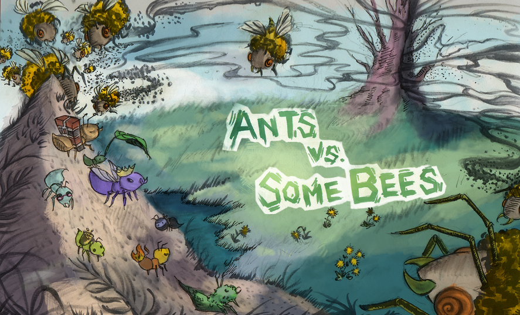

*蜜蜂来了！ 用继承蚂蚁
创造一个更好的士兵。*

## **介绍**

试着按顺序尝试问题，因为后面的一些问题建立在前面问题的基础上，因此在运行ok测试时也是如此。

在此项目中，您将创建一款名为蚂蚁大战蜜蜂的塔防游戏。
作为蚁后，你可以召集最勇敢的蚂蚁来填充你的蚁群。
你的蚂蚁必须保护它们的蚁后免受入侵你领地的邪恶蜜蜂的侵害。
通过向蜜蜂扔树叶来足够激怒它们，它们就会被击败。
如果未能充分纠缠空中入侵者，您的蜂王就会屈服于蜜蜂的愤怒。
该游戏的灵感来自 PopCap Games 的 《植物大战僵尸》。

当学生在没有仔细阅读问题描述的情况下尝试实现这些功能时，他们经常会遇到问题。😱 **在开始编码之前仔细阅读每个描述。**

## **下载入门文件**
您可以将所有项目代码下载为[zip 存档](https://cs61a.org/proj/ants/ants.zip)。该项目包含多个文件，但您的更改将仅针对 ants.py. :

- ants.py：蚂蚁大战蜜蜂的游戏逻辑。
- ants_gui.py：蚂蚁大战蜜蜂的原始 GUI。
- gui.py:蚂蚁大战蜜蜂的新 GUI。
- graphics.py：显示简单二维动画的实用程序。
- utils.py：一些方便游戏界面的功能。
- ucb.py：CS 61A 的实用功能
- state.py：gui.py 游戏状态的抽象
- assets：使用的图像和文件的目录gui.py
- img：使用的图像目录ants_gui.py
- ok：自动评分器
- proj3.ok：ok配置文件
- tests：使用的测试目录ok

## **后勤**

您将上交以下文件：

- ants.py

您无需修改​​或提交任何其他文件即可完成该项目。

对于我们要求您完成的功能，我们可能会提供一些初始代码。如果您不想使用该代码，请随意删除它并从头开始。您还可以根据需要添加新的函数定义。

**但是，请不要修改任何其他功能或编辑上面未列出的任何文件**。这样做可能会导致您的代码无法通过我们的自动评分器测试。另外，请不要更改任何函数签名（名称、参数顺序或参数数量）。

在整个项目中，您应该测试代码的正确性。经常测试是一个很好的做法，这样就可以轻松隔离任何问题。但是，您不应该*过于*频繁地进行测试，以便让自己有时间思考问题。

我们提供了一个**自动评分器**ok来帮助您测试代码并跟踪您的进度。第一次运行自动评分器时，系统会要求您**使用网络浏览器使用 Ok 帐户登录**。请这样做。每次运行时ok，它都会在我们的服务器上备份您的工作和进度。

ok的主要目的是测试您的实现。

如果你想以交互方式测试你的代码，你可以运行 

```python
python ok -q [题号] -i
```

插入适当的问题编号（例如01）。这将运行该问题的测试，直到您的第一个失败，然后让您有机会以交互方式测试您编写的函数。

您还可以通过编写以下内容来使用 OK 中的调试打印功能 

```python
print（“DEBUG：”，x）
```

这将在您的终端中产生输出，而不会导致 OK 测试因额外输出而失败。 


## **游戏**

蚂蚁大战蜜蜂的游戏。由蜜蜂组成一系列回合。
在每一轮中，新的蜜蜂都可能进入蚁群。
然后，新的蚂蚁被放置来保卫它们的蚁群。
最后，所有昆虫（蚂蚁，然后是蜜蜂）都会采取单独的行动。
蜜蜂要么试图向隧道的尽头移动，要么蜇蚂蚁挡道。
蚂蚁根据其类型采取不同的行动，
例如收集更多食物或向蜜蜂扔树叶。
当蜜蜂到达隧道尽头（您输）、
如果存在蚁后蜜蜂摧毁蚁后（您输）
或整个蜜蜂舰队被击败（您赢）时，游戏就会结束。

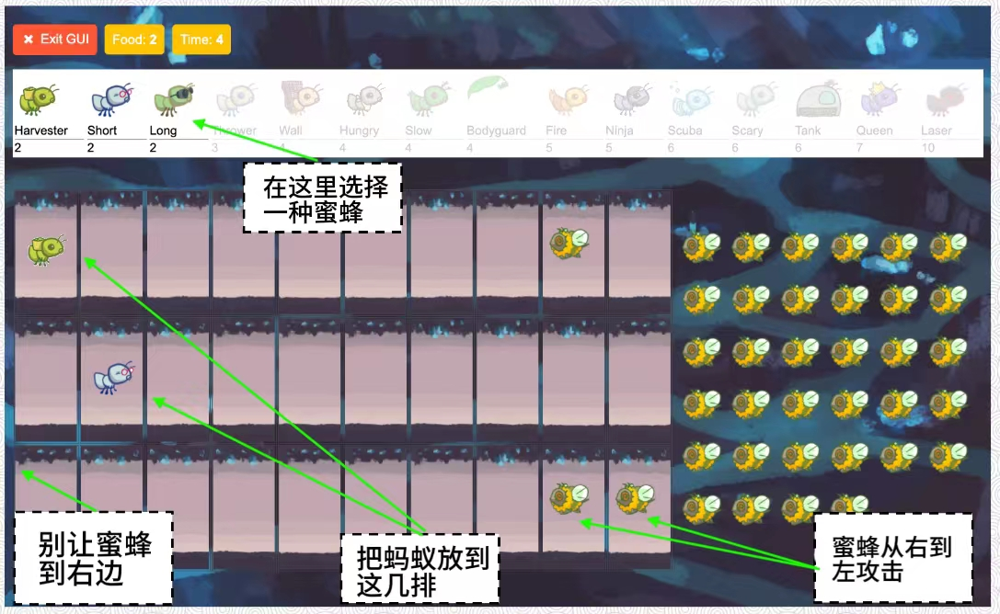

### **核心理念**

**殖民地**。这就是游戏发生的地方。蜂群由数个地方链组成，形成一条隧道，蜜蜂可以从中穿过。
蚁群中还有一定数量的食物，可以用来将蚂蚁放入隧道中。

**地方**。一个地方连接到另一个地方形成隧道。玩家可以在每个地方放置一只蚂蚁。然而，一个地方可能有很多蜜蜂。

**蜂巢**。这里是蜜蜂的发源地。蜜蜂离开蜂巢进入蚁群。

**蚂蚁**。玩家通过从屏幕顶部的可用蚂蚁类型中进行选择来将蚂蚁放入蚁群中。
每种类型的蚂蚁都会采取不同的行动，并且需要放置不同数量的蚁群食物。
两种最基本的蚂蚁类型是收割蚂蚁，每轮向蚁群添加一种食物，
以及投掷蚂蚁，每轮向蜜蜂扔一片叶子。您将实现更多！

**蜜蜂**。在这款游戏中，蜜蜂是玩家必须保卫蚁群的敌对力量。每转一圈，如果没有蚂蚁挡道，蜜蜂要么前进到隧道中的下一个地方，要么蜇伤挡道的蚂蚁。
当至少一只蜜蜂到达隧道尽头时，蜜蜂获胜。

### **核心课程**

上面描述的每个概念都有一个对应的类，封装了该概念的逻辑。下面总结一下这个游戏涉及到的主要类：

- **GameState** ：代表游戏中的殖民地和一些状态信息，包括有多少食物可用，经过了多少时间，AntHomeBase在哪里以及游戏中的所有Place。

- **Place** ：表示容纳昆虫的单个地方。一个地方最多只能有一只蚂蚁，但是可以有许多只蜜蜂。地方对象有一个向左的出口和一个向右的入口，它们也是地方。蜜蜂通过移动到一个地方的出口穿过隧道。
一个地方连接到另一个地方形成隧道。玩家可以在每个地方放置一只蚂蚁。然而，一个地方可能有很多蜜蜂。

- **Hive** ：代表蜜蜂开始的地方（在隧道的右侧）。

- **AntHomeBase** ：代表蚂蚁们正在捍卫的地方（在隧道左侧）。如果蜜蜂到达这里，它们就赢了 :( 。

- **Insect** ：蚂蚁和蜜蜂的超类。所有昆虫都有健康属性，表示它们剩余的生命值，以及一个地点属性，表示它们当前所在的地点。每一轮，游戏中的每只活跃昆虫都会执行它的动作。

- **Ant**：代表蚂蚁。每个蚂蚁子类都有特殊的属性或特殊行动，使其与其他蚂蚁类型区分开来。例如，收割蚂蚁为群体获取食物，投掷蚂蚁攻击蜜蜂。每种蚂蚁类型还具有食物成本属性，
表示部署该类型的一单位蚂蚁需要多少食物成本。

- **Bee** ：代表蜜蜂。每个回合，蜜蜂要么移动到当前位置的出口（如果该位置没有被蚂蚁挡住），要么刺伤占据同一位置的蚂蚁。

### **游戏布局**

下面是 GameState 的可视化。当您完成解锁测试和问题时，我们建议您绘制类似的图表来帮助您理解。

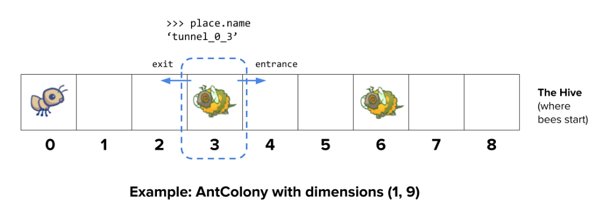

### **对象图**

为了帮助直观地了解所有类如何组合在一起，我们还创建了一个对象映射供您在工作时参考，您可以在[此处](https://inst.eecs.berkeley.edu/~cs61a/fa22/proj/ants/diagram/ants_diagram.pdf)找到它。

### **玩游戏**

该游戏可以以两种模式运行：作为基于文本的游戏或使用图形用户界面（GUI）。两种情况下的游戏逻辑都是相同的，
但 GUI 强制执行回合时间限制，使游戏变得更加刺激。提供基于文本的界面用于调试和开发。

文件根据这两种模式进行分离。 ants.py对图形或回合时间限制一无所知。

要启动基于文本的游戏，请运行

```python
python ants_text.py
```

要启动图形游戏，请运行
```python
python gui.py
```

当您启动图形版本时，应该会出现一个新的浏览器窗口。在初始实现中，你有无限的食物，而你的蚂蚁只能向当前的蜜蜂扔叶子。在完成问题 2 之前，GUI 可能会崩溃，
因为它还没有完全了解Place是什么！另外，现在投掷蚂蚁只能攻击它们中有蜜蜂的地方，仅靠这些就很难获胜。无论如何，尝试玩游戏吧！您需要放置很多投掷蚂蚁（第二种），
以防止蜜蜂接近您的蜂后。

该游戏有多个选项，您将在整个项目中使用，您可以使用 查看**python ants_text.py --help**。

```python
usage: ants_text.py [-h] [-d DIFFICULTY] [-w] [--food FOOD]

Play Ants vs. SomeBees

optional arguments:
  -h, --help     show this help message and exit
  -d DIFFICULTY  sets difficulty of game (test/easy/normal/hard/extra-hard)
  -w, --water    loads a full layout with water
  --food FOOD    number of food to start with when testing
```

## **第一阶段：基本游戏玩法**

在第一阶段，您将完成实现，该实现将允许使用两个基本的蚂蚁进行基本游戏： HarvesterAnt和ThrowerAnt。

### **问题 0(0分)**

阅读整个**ants.py**文件后回答以下问题。

如果您在回答这些问题时遇到困难，您可以尝试重新通读**ants.py**，
了解上面的**核心概念/类**部分。

1. 昆虫的**health**属性有什么意义？这个值会改变吗？如果是这样，怎么办？

2. 以下哪一项是**Insect**类的类属性？

3. **Ant**类的**health**属性是实例属性还是类属性？为什么？

4. **Ant**子类（例如**ThrowerAnt**）的**damage**属性是实例属性还是类属性？为什么？

5. **Ant**和**Bee**都继承自哪个类？

6. **Ant**的实例和**Bee**的实例有什么共同点？

7. 任何给定时间，在一个地方最多可以有多少昆虫（在问题8之前）？

8. 蜜蜂在它的一个回合中做什么？

9.比赛什么时候输？

要提交您的答案，请运行：
```python
python ok -q 00 -u
```

> **关于解锁测试的说明：** 如果您想在完成解锁测试后查看解锁问题，您可以导航到（在文件夹内ants）tests文件夹。例如，解锁问题0后，您可以在 处查看解锁测试tests/00.py。

### **问题 1(1分)**

**A部分：** 目前，放置任何类型的蚂蚁都没有成本，因此游戏没有挑战性。基类Ant的food_cost为零。根据下表中的“食品成本”列，为HarvesterAnt和ThrowerAnt覆盖此类属性。

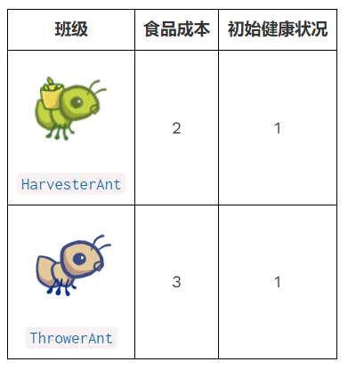

**B部分:** 现在放置蚂蚁需要花费食物，我们需要能够收集更多的食物！为了解决这个问题，实现HarvesterAnt类。HarvesterAnt是一种Ant类型，它将一个食物添加到gamestate.food总数中作为其行动。

在编写任何代码之前，请解锁测试以验证您对问题的理解：
```python
python ok -q 01 -u
```

完成解锁后，开始实施您的解决方案。您可以通过以下方式检查您的正确性：
```python
python ok -q 01
```

### **问题 2(1分)**

在这个问题中，你需要通过添加代码来完善**Place.__init__**，
以便跟踪入口。目前，一个Place只能跟踪它的出口。
我们希望一个**Place***也能跟踪它的入口。一个**Place**只需要跟踪一个入口。
当一只蚂蚁需要查看隧道前面有哪些蜜蜂时，跟踪入口将非常有用。

然而，仅仅通过将入口传递给**Place**构造函数会有问题；
我们需要在创建**Place**之前同时拥有出口和入口！
（这是一个先有鸡还是先有蛋的问题。）
为了解决这个问题，我们将采用以下方式跟踪入口。
**Place.__init__**应该使用这个逻辑：

- 一个新创建的**Place**始终以其入口为**None**。
- 如果这个**Place**有一个出口，那么出口的入口就被设置为这个**Place**。


> 提示：请记住，当调用**__init__**方法时，第一个参数**self**会绑定到新创建的对象上。

> 提示：如果感到困惑，可以尝试将两个地点并排画出来。在**GUI**中，一个地点的入口在其右侧，而出口在其左侧。

>提示：记住，地点不是存储在列表中的，因此您无法索引任何内容来访问它们。这意味着您无法像**colony [index + 1]**这样做以访问相邻的**Place**。您如何从一个地方移动到另一个地方？

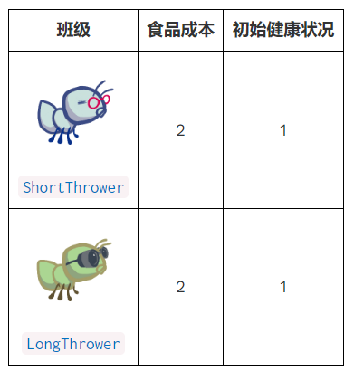

在编写任何代码之前，请解锁测试以验证您对问题的理解：
```python
python ok -q 02 -u
```

完成解锁后，开始实施您的解决方案。您可以通过以下方式检查您的正确性：
```python
python ok -q 02 
```

### **问题 3(2分)**

为了让投掷蚂蚁投掷叶子，它必须知道要击中哪只蜜蜂。
**ThrowerAnt**类中**nearest_bee**方法的提供实现只允许它们击中同一地点的蜜蜂。
你的工作是修复它，让投掷蚂蚁会投掷到它前面最近的**不在蜂巢中的蜜蜂**。
这包括与投掷蚂蚁在同一地点的蜜蜂。

> 提示：所有地点都有一个**is_hive**属性，当该地点是蜂巢时为**True**。

修改**nearest_bee**函数，使其返回最近的一个有蜜蜂的地方的随机蜜蜂。你的实现应该遵循这个逻辑：

- 从 ThrowerAnt 的当前位置开始。

- 对于每个地方，如果有随机蜜蜂，
请返回一个；如果没有，请检查其前面的地方（存储为当前位置的**入口**）。

- 如果没有蜜蜂可以攻击，返回**None**。

> 提示：**ants.py** 中提供的 **random_bee **函数从蜜蜂列表中返回一个随机蜜蜂，
如果列表为空，则返回**None**。

> 提示：作为提醒，如果一个地方没有蜜蜂存在，则该地方实例的蜜蜂属性将是一个空列表。

> 提示：难以想象测试用例？试着在纸上画出来！
**游戏布局**中提供的示例图显示了此问题的第一个测试用例。

在编写任何代码之前，请解锁测试以验证您对问题的理解：
```python
python ok -q 03 -u
```

完成解锁后，开始实施您的解决方案。您可以通过以下方式检查您的正确性：
```python
python ok -q 03
```

实现了**nearest_bee**之后，**ThrowerAnt**应该能够向其前方不在蜂巢中的**Bee**投掷。
确保您的蚂蚁做正确的事情！为了开始一个拥有十个食物的游戏（以便进行简单测试）：
```python
python gui.py --food 10
```

请确保在检查点截止日期之前使用以下命令提交：
```python
python ok --submit
```

你可以检查是否完成了第一阶段的问题，方法是运行：
```python
python ok --score
```

恭喜！您已经完成了这个项目的第一阶段！


## **第二阶段：更多蚂蚁！**

现在你已经实现了具有两种类型蚂蚁的基本游戏玩法，让我们为蚂蚁攻击蜜蜂的方式增加一些特色。
在这个问题和之后，你将实现几种不同的蚂蚁，它们具有不同的攻击策略。

**在这些部分实现每个Ant子类后，您需要将其实现的类属性设置为True，**
以便该类型的蚂蚁将出现在GUI中。随时随地尝试使用每个新蚂蚁测试功能！

从现在开始，使用**python3 gui.py -d easy**来对抗一个多隧道布局中的一群蜜蜂，
并尝试**-d normal**，**-d hard**或**-d extra-hard**如果你想要一个真正的挑战！
如果蜜蜂太多而无法征服，您可能需要创建一些新的蚂蚁。

###**问题 4(2分)**

投掷蚂蚁对蜜蜂构成了强大的威胁，但其食物成本高昂。在这个问题中，您将实现两个**ThrowerAnt**的子类，
它们的成本较低，但对它们可以投掷的距离有限制。

- **长距离投手**只能在经过至少5个入口转换后找到的蜜蜂上投掷。它不能打中与它处于同一位置或在它前面的前4个位置的蜜蜂。如果有两只蜜蜂，一只太靠近长距离投手，另一只在它的范围内，
长距离投手应该只投掷距离更远的蜜蜂，而不是试图打近距离的蜜蜂。

- **短距离投手**只能投掷在跟随最多3个入口转换后找到的蜜蜂。
它无法投掷到超过它前面3个地方的任何蜜蜂。

这两个专业的投手都无法将距离恰好为4个位置的蜜蜂扔掉。

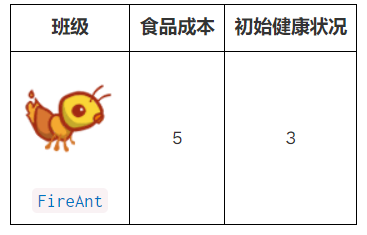

要实现这些新的投掷蚂蚁，您的**ShortThrower**和**LongThrower**类应该从基础**ThrowerAnt**类继承**nearest_bee**方法。
选择攻击哪只蜜蜂的逻辑是相同的，除了**ShortThrower**和*LongThrower蚂蚁**，
它们的范围分别受到下限和上限的限制。

要做到这一点，修改**nearest_bee**方法以引用**lower_bound**和**upper_bound**属性，
并且仅在其范围内返回蜜蜂。

确保在**ThrowerAnt**类中为这些**lower_bound**和**upper_bound**属性分配适当的值，
以使**ThrowerAnt**的行为不变。然后，使用适当的约束范围实现子类**LongThrower**和**ShortThrower**。

您**不需要**在 ThrowerAnt、 ShortThrower 和 LongThrower 之间重复任何代码。

> 提示:** float (‘ inf’)**返回一个表示为浮点数的无限正值，可以与其他数字进行比较。

> 提示: 您可以在 Python 中将不等式链接起来: 例如，2 < x < 6将检查 x 是否介于2和6之间。此外，下限和上限应该标记一个包含范围。

> **重要提示**: 确保您的类属性被称为上限和下限。测试直接引用这些属性名称，如果您为这些属性使用其他名称，则会出错。

不要忘记将 LongThrower 和 ShortThrower 实现的类属性设置为**True**。

在编写任何代码之前，解锁测试以验证您对问题的理解:
```python
python ok -q 04 -u
```

在编写代码之后，测试您的实现(重新运行03的测试，以确保它们仍然可以工作) :
```python
python ok -q 03
```
```python
python ok -q 04
```

[**结对编程？**](https://inst.eecs.berkeley.edu/~cs61a/fa22/articles/pair-programming/)请记住在驱动程序和导航器角色之间交替使用。驾驶员控制键盘，导航员观察，提问，并提出想法。

###**问题 5(3分)**

实现**FireAnt**，它在受到损害时会造成损害。
具体来说，如果它受到**amount**生命单位的伤害，它会对所有在其位置的蜜蜂造成伤害**amount**(这被称为反射伤害)。
如果它死亡，它会造成额外的伤害，这是由它的**damage**属性指定的，该属性在**FireAnt**类中定义的默认值为3。

要实现这一点，请重写**Insect**的**reduce _ health**方法。
重写的方法应该调用从超类(**Ant**)继承的**reduce _ health**方法，
该超类继承自其超类**Insect**，以减少当前**FireAnt**实例的健康状况。
在**FireAnt**实例上调用继承的**reduce _ health**方法会以给定的数量减少昆虫的健康状况，
并在昆虫的健康状况达到零或更低时将其从原位移除。

> 提示：不要调用**self.reduce_health**否则你最终会陷入递归循环。（你能明白为什么吗？）

但是，您的方法还需要包含反射损坏逻辑：

- 确定反射伤害量：从对**amount**蚂蚁造成的伤害开始，**damage**如果蚂蚁的生命值降至或低于 0，则添加。

- 对于该地方的每只蜜蜂，通过为每只蜜蜂调用适当的方法来对它们造成总伤害**reduce_health**。

> 重要提示：请记住，当任何Ant失去所有生命值时，它就会从其中删除**place**，因此请仔细注意逻辑顺序中的**reduce_health**。


> 提示：伤害蜜蜂可能会导致其被从原来的位置移走。如果您迭代列表，但同时更改了该列表的内容，则[可能无法访问所有元素](https://docs.python.org/3/tutorial/controlflow.html#for-statements)。
> 可以通过复制列表来防止这种情况。您可以使用列表切片，或使用内置list函数来确保我们不会影响原始列表。
```python
>>> lst = [1,2,3,4]
>>> lst[:]
 [1, 2, 3, 4]
>>> list(lst)
 [1, 2, 3, 4]
>>> lst[:] is not lst and list(lst) is not lst
 True
```

完成**FireAnt**的实现之后，给它一个用值**True**实现的类属性。

> 注意: 即使您覆盖了超类的reduce _ health函数(Ant.reduce _ health)，仍然可以通过调用它在实现中使用这个方法。注意，这不是递归。(为什么?)

在编写任何代码之前，请解锁测试以验证您对问题的理解：
```python
python ok -q 05 -u
```

完成解锁后，开始实施您的解决方案。您可以通过以下方式检查您的正确性：
```python
python ok -q 05
```

您也可以通过玩一两个游戏来测试您的程序！
当火蚁被蛰时，它应该消灭所有同位置的蜜蜂。以十种食物开始一场游戏(为了便于测试) :
```python
python gui.py --food 10
```

### **问题 6(1分)**

我们将通过实现**WallAnt**为我们光荣的大本营增加一些保护，**WallAnt**是一种每回合不做任何事情的蚂蚁。
**WallAnt**很有用，因为它具有很大的健康值。

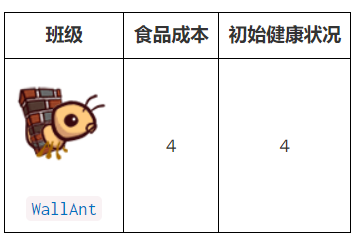

与前面的蚂蚁不同，我们没有为您提供类头。
从头实现**WallAnt**类。给它一个值为**Wall**的类属性名(这样图形就可以工作了)和一个值**True**的类属性(这样你就可以在游戏中使用它了)。

> 提示：首先，看一下前面问题的蚂蚁是如何实现的！
> 提示：确保您__init__也实现了该方法，以便WallAnt从适当数量的开始health！

在编写任何代码之前，请解锁测试以验证您对问题的理解：
```python
python ok -q 06 -u
```
完成解锁后，开始实施您的解决方案。您可以通过以下方式检查您的正确性：
```python
python ok -q 06
```

### **问题 7(3分)**

执行**HungryAnt**，它将从它的位置随机选择一个蜜蜂，并通过吃掉整个蜜蜂来对蜜蜂造成伤害。
在吃了一只蜜蜂后，HungryAnt必须花3轮咀嚼才能再次进食。
当饥饿蚂蚁咀嚼时，它不能吃任何蜜蜂(对蜜蜂造成伤害)。3个回合后，如果没有蜜蜂可以吃，HungryAnt将什么也不做。

> 提示：当一个蜜蜂被吃掉时，它会失去所有生命值。是否存在我们可以调用一个现有的函数Bee，可以将其健康状况降至0？

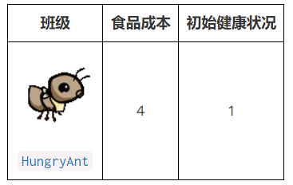

给HungryAnt一个**chewing_turns**类属性，用于存储HungryAnt咀嚼所需的回合数(设置为3)。
另外，给每个HungryAnt一个实例属性**turns_to_chew**，用于计算它还剩下的咀嚼回合数(初始化为0，因为它一开始没有吃任何东西)。
你也可以将turnns_to_chew看作是直到HungryAnt能够吃掉另一只蜜蜂为止的回合数。

实现HungryAnt的操作方法: 首先，检查它是否在咀嚼; 
如果是，减少它的turn _ to _咀嚼次数。否则，通过将蜜蜂的健康值降低到0来随机吃掉一只蜜蜂。当蜜蜂被吃掉的时候，一定要设置好咀嚼的回合！

> 提示：除了方法之外action，请确保您__init__也实现了该方法，以便定义任何实例变量，并确保HungryAnt有适当的数量health！

在编写任何代码之前，请解锁测试以验证您对问题的理解：
```python
python ok -q 07 -u
```
完成解锁后，开始实施您的解决方案。您可以通过以下方式检查您的正确性：
```python
python ok -q 07
```
我们现在拥有一些强大的进攻部队来帮助消灭蜜蜂，但我们还要确保我们也能继续做好防御工作。在这个阶段，您将实现具有特殊防御能力的蚂蚁，例如增加生命值并保护其他蚂蚁能力。

[**结对编程？**](https://inst.eecs.berkeley.edu/~cs61a/fa22/articles/pair-programming/)这将是转换角色的好时机。转换角色可确保你们能够从担任每个角色的学习经历中受益。

### **问题 8(3分)**

现在，我们的蚂蚁非常脆弱。我们想提供一种方法，帮助它们更持久地抵御蜜蜂的攻击。输入**BodyguardAnt**。

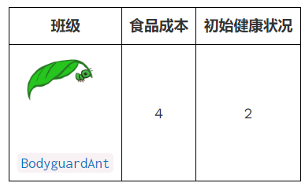

为了实现这一点BodyguardAnt，我们将把这个问题分成3个子部分。在每个部分中，我们都会在ContainerAnt类、Ant类或BodyguardAnt类中进行更改。

> 注意： 您必须完成的每个部分都有单独的解锁测试。我们建议在为其编写任何代码之前先对每个子部分进行解锁测试。您将在此问题的最后立即测试所有子部分的代码。

#### **问题8a**

**BodyguardAnt**不同于普通蚂蚁，因为它是一个容器蚂蚁;
它可以容纳另一只蚂蚁并保护它，都在一个地方。
当蜜蜂在一只蚂蚁包围另一只蚂蚁的地方蛰蚂蚁时，只有容器被损坏。
在容器中的蚂蚁仍然可以执行它原来的动作。如果容器坏了，里面的蚂蚁仍然留在那里(然后可能会被损坏)。

每个**ContainerAnt**都有一个实例属性**ant_contained**，
用来存储它所包含的蚂蚁。这个ant ,ant_contained，初始值为**None**，表示还没有存储蚂蚁。
实现**store_ant**方法，以便将ContainerAnt的ant_contained实例属性设置为传入的ant参数。
还要实现ContainerAnt的action方法，以便在当前包含蚂蚁时执行其ant_contained的动作。

另外，为了保证容器和它所包含的蚂蚁可以同时监听一个位置（每个位置最多有两只蚂蚁），
但前提是恰好有一个是容器，我们可以创建一个方法**can_contain**。

已经有一个Ant.can_contain方法，但它总是返回**False**。重写该方法ContainerAnt.can_contain，使其接受**other**作为ant参数并True在以下情况下返回：
- 这个 ContainerAnt 还没有包含另一只蚂蚁。
- 另一只蚂蚁不是容器。

在编写任何代码之前，请解锁测试以验证您对问题的理解：
```python
python ok -q 08a -u
```
完成解锁后，开始实施您的解决方案。您可以通过以下方式检查您的正确性：
```python
python ok -q 08a
```

> ContainerAnt的构造函数。__init__的实现如下:
>    def __init__(self, *args, **kwargs):
        super().__init__(*args, **kwargs)
        self.ant_contained = None
> 
> 正如我们在**猪的游戏**中看到的，args绑定到所有的位置参数（这些参数都不是带参数传递的参数），并且kwargs绑定到所有的参数。这确保参数都传递给Ant构造函数。
>
> 实际上，这意味着构造函数与其父类的构造函数(Ant.__init__)完全相同，但这里我们还设置了self.ant_contained=None。注意，您不需要修改这个构造函数。

> 提示:您可能会发现每个Ant具有的is_container属性对于检查特定Ant是否为容器很有用。

#### **问题8b**

修改Ant.add_to为允许容器和非容器蚂蚁按照以下规则相同位置：

- 如果原来占据一个位置的蚂蚁可以包含被添加的蚂蚁，则两只蚂蚁都占据该位置并且原来的蚂蚁包含被添加的蚂蚁。
- 如果添加的蚂蚁可以包含空间中原来的蚂蚁，则两只蚂蚁都占据该位置，并且添加的（容器）蚂蚁包含原始蚂蚁。
- 如果两个Ant都不能包含另一个，则引发与之前相同的AssertionError(已经存在于启动代码中的那个)。
- **重要提示:**如果在特定的Place中有两只蚂蚁，那么Place实例的ant属性应该引用容器蚂蚁，并且容器蚂蚁应该包含非容器蚂蚁。

在编写任何代码之前，请解锁测试以验证您对问题的理解：
```python
python ok -q 08b -u
```
完成解锁后，开始实施您的解决方案。您可以通过以下方式检查您的正确性：
```python
python ok -q 08b
```

> 提示：您还应该使用can_contain您编写的方法并避免重复代码。
>
> **注意**：如果您通过 VSCode Pylance 扩展收到“无法访问的代码”警告Ant.add_to，则可以忽略此特定警告，因为代码实际上正在运行（本例中的警告不准确）。

####**问题8c**

添加一个**BodyguardAnt.__init__**设置蚂蚁的初始健康值。我们不需要在这里创建一个动作方法，因为bodyguard类从ContainerAnt类继承了它。

一旦你完成了bodyguard的实现，给它一个实现值为True的类属性。

在编写任何代码之前，请解锁测试以验证您对问题的理解：
```python
python ok -q 08c -u
```
完成解锁后，开始实施您的解决方案。您可以通过以下方式检查您的正确性：
```python
python ok -q 08c
```

在编写任何代码之前，请解锁测试以验证您对问题的理解：
```python
python ok -q 08 -u
```
完成解锁后，开始实施您的解决方案。您可以通过以下方式检查您的正确性：
```python
python ok -q 08
```

### **问题 9(2分)**

BodyguardAn提供了强大的防御，但他们说最好的防御是好的进攻。
**TankAnt**是一种容器蚂蚁，每回合可以保护其所在位置的蚂蚁，并对其所在位置的所有蜜蜂造成1点伤害。像任何ContainerAnt一样，TankAnt允许它所包含的蚂蚁每回合执行它的动作。

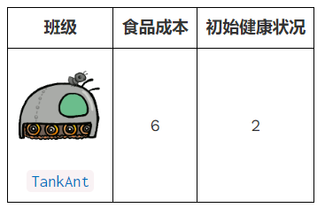

我们没有为您提供类头文件。从头实现TankAnt类,给它一个带有**Tank**值的类属性名(以便图像工作)和一个带有**True**值的类属性执行(以便你可以在游戏中使用它)。

您不需要修改TankAnt类之外的任何代码。如果您发现自己需要在其他地方进行更改，
请为前面的问题寻找一种方法来编写代码，使其不仅适用于bodyguard和TankAnt对象，
而且适用于一般的容器蚂蚁。

> 提示:您需要从TankAnt的父类重写的唯一方法是__init__和action。

> 提示：与同样FireAnt，损坏蜜蜂可能会导致其从原来的位置移走。

在编写任何代码之前，请解锁测试以验证您对问题的理解：
```python
python ok -q 09 -u
```
完成解锁后，开始实施您的解决方案。您可以通过以下方式检查您的正确性：
```python
python ok -q 09
```

确保在检查点使用以下命令先于日期之前提交：
```python
python ok --submit
```
您可以通过运行以下命令来检查以确保您已完成第 2 阶段的问题：
```python
python ok --score
```

恭喜！您已经完成了该项目的第二阶段！

## **第三阶段：水与力量**

在最后阶段，您将通过引入一种新型地点并能够引发该地点的新蚂蚁来为游戏添加最后一个打击。其中一只蚂蚁是所有蚂蚁中最重要的：蚁后！

### **问题 10(1分)**

我们给蚁群加水吧!目前只有两种类型的地方，蜂巢和一个基本的地方。为了让事情变得更有趣，我们将创建一种名为Water的新型Place。

只有防水的昆虫才能放在水里。为了确定昆虫是否防水，向昆虫类添加一个名为**is_waterproof**的新类属性，并将其设置为**False**。
因为蜜蜂会飞，所以将它们的**is_waterproo**f属性设置为**True**，覆盖继承的值。

现在，为Water实现add_insect方法。首先，将昆虫添加到不管是否防水的地方。然后，如果昆虫不防水，将昆虫的生命值降为0。
不要重复程序中其他地方的代码。相反，应该使用已经定义的方法。

在编写任何代码之前，请解锁测试以验证您对问题的理解：
```python
python ok -q 10 -u
```
完成解锁后，开始实施您的解决方案。您可以通过以下方式检查您的正确性：
```python
python ok -q 10
```

完成此问题后，玩一个包含水的游戏。要访问wet_layout包含水的，请在开始游戏时添加该--water选项（或-w类似）。
```python
python gui.py --water
```

[**结对编程?**](https://inst.eecs.berkeley.edu/~cs61a/fa22/articles/pair-programming/)请记住在所有权和领航员角色之间交替。驱动程序控制键盘；领航员观察、提出问题并提出想法。

### **问题 11(1分)**

目前没有蚂蚁可以放在水上。实现**ScubaThrower**，它是ThrowerAnt的一个子类，更昂贵且防水，但在其他方面与其基类相同。
**ScubaThrower**在水中不会失去生命值。

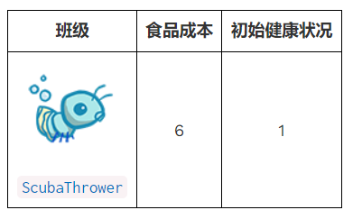

在编写任何代码之前，请解锁测试以验证您对问题的理解：
```python
python ok -q 11 -u
```
完成解锁后，开始实施您的解决方案。您可以通过以下方式检查您的正确性：
```python
python ok -q 11
```

### **问题 12(3分)**

最后，实现**QueenAnt**。蚁后是一个防水的水蚁，她的勇敢激励着她的同伴们。
除了标准的ScubaThrower动作外，蚁后每次执行一个动作时，她身后所有蚂蚁的伤害都会翻倍。
一旦蚂蚁的伤害加倍，在随后的回合中不会再加倍。

> 注意:**FireAnt**的反射伤害不应该加倍，只有当它的生命值降为0时造成的额外伤害。

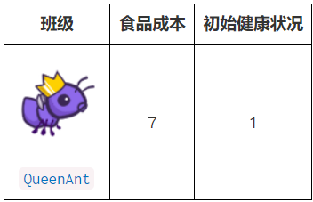

然而，权力越大，责任也越大。QueenAnt受三个特殊规则的约束：

1.如果蚁后的生命值降至0，蚂蚁就输了。你需要控制昆虫。在QueenAnt中调用reduce_health并在这种情况下调用ants_lose()，
以便向模拟器发出游戏结束的信号。(如果有蜜蜂到达隧道的尽头，蚂蚁也会输。)

2.蚁后只能有一个。第二个蚁后是无法建造的。为了检查是否可以构造一个Ant，我们使用Ant.construct()类方法如果可能的话构造一个Ant，否则返回None。您需要重写Ant。构造为QueenAnt的类方法，以便添加此检查。
为了跟踪皇后是否已经创建，您可以使用添加到当前GameState的实例变量。(GameState类在ants.py的底部附近定义)。

3.蚁后不能被移走。试图移除皇后应该没有效果(但不应该导致错误)。
您需要重写QueenAnt中的Ant.remove_from来强制执行此条件。

> 提示:为了使她身后所有蚂蚁的伤害加倍，您可以填写在Ant类中定义的double方法。double方法可以在适当的QueenAnt实例方法中使用。为了避免将蚂蚁的伤害加倍，可以在QueenAnt.action的调用中持续标记被加倍伤害的蚂蚁。

> 提示：当使蚂蚁的伤害加倍时，请记住，一只Place中可以有不止一只蚂蚁，例如一只蚂蚁正在保护另一只蚂蚁。

> 提示:记住，QueenAnt的reduce_health方法在父类的reduce_health方法中添加了调用ants_lose的额外任务。我们如何确保我们仍然做一切从父类的方法不重复代码?

> 提示：想想如何调用的construct超类方法QueenAnt。请记住，您最终想要构造一个QueenAnt，而不是常规的Ant或一个ScubaThrower。

> 注意: construct方法有cls作为参数。这个功能类似于我们在实例方法中使用self的方式。因此，当我们调用类方法时，我们不需要将cls作为参数来调用它。阅读更多关于类方法的信息。点击[这个](https://pencilprogrammer.com/python-self-vs-cls/)关于CLS vs.self的在线指南。

在编写任何代码之前，请解锁测试以验证您对问题的理解：
```python
python ok -q 12 -u
```
完成解锁后，开始实施您的解决方案。您可以通过以下方式检查您的正确性：
```python
python ok -q 12
```

### **额外问题(2分)**

实现一个不造成任何伤害的最终投掷蚂蚁，而是对它调用throw_at 的Bee实例的动作方法应用一个临时效果。我们将实现这个新的蚂蚁，SlowThrower，它继承自ThrowerAnt。

**SlowThrower**向蜜蜂投掷粘性糖浆，使其减速5个回合。
当蜜蜂减速时，它会在gamestate.time时采取常规的蜜蜂动作。时间是均匀的，不采取行动(不移动或刺)否则。如果一只蜜蜂在被糖浆击中时已经减速，
那么它将从最近一次被糖浆击中开始减速5个回合。也就是说，如果一只蜜蜂被糖浆击中，需要2个回合，然后再次被糖浆击中，那么它将在第二次被糖浆击中后减速5个回合。

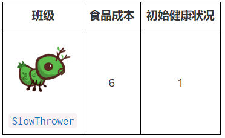

为了完成这个SlowThrower的实现，您需要适当地设置它的类属性，并在SlowThrower中实现throw_at方法。

**重要限制:**对于这个问题，您不能修改SlowThrower类之外的任何代码。
这意味着你不能修改蜜Bee.ction方法。我们的测试会检查这个。

> 提示:指定target.action传递给一个函数，该函数有时会调用Bee.action。你可以使用实例属性来跟踪蜜蜂还会被减速多少回合，一旦效果结束，Bee.action每个回合都应该调用动作。

在编写任何代码之前，请解锁测试以验证您对问题的理解：
```python
python ok -q EC -u
```
完成解锁后，开始实施您的解决方案。您可以通过以下方式检查您的正确性：
```python
python ok -q EC
```

一定要测试你的代码!你的代码应该能够在一个目标上应用多个状态;每个新状态都适用于蜜蜂当前(可能以前受影响)的动作方法。


## **任选问题**

### **任选问题1**

实现NinjaAnt，它会伤害所有经过的蜜蜂，但永远不会被蜇。

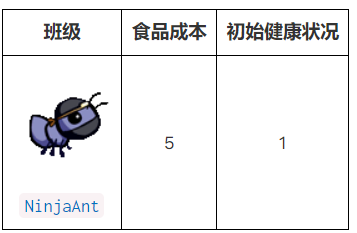

**NinjaAnt**不会挡住飞过的蜜蜂的去路。要实现这种行为，首先修改Ant类，使其包含一个新的类属性blocks_path，并将其设置为True，然后在NinjaAnt类中将blocks_path的值重写为False。

其次，修改blocked的蜜蜂的方法，使其返回False，
如果在蜜蜂的位置没有蚂蚁，或者如果有蚂蚁，但其blocks_path属性为False。现在蜜蜂只会飞过NinjaAnt。

最后，我们想让NinjaAnt伤害所有飞过的蜜蜂。
在NinjaAnt中执行动作方法，通过damage属性减少与NinjaAnt相同位置的所有蜜蜂的生命值。
与FireAnt类似，您必须遍历可能发生变化的蜜蜂列表。

> 提示:在可视化测试用例方面有困难吗?试着把它们画在纸上!请参阅游戏布局中的示例以获得帮助。

在编写任何代码之前，请解锁测试以验证您对问题的理解：
```python
python ok -q optional1 -u
```
完成解锁后，开始实施您的解决方案。您可以通过以下方式检查您的正确性：
```python
python ok -q optional1
```

对于挑战，尝试仅使用HarvesterAnt并赢得游戏NinjaAnt。

### **任选问题2**

我们已经秘密研发这种蚂蚁很长时间了。它太危险了，我们不得不把它锁在超级隐蔽的CS61A地下保险库里，但我们最终认为它已经准备好上场了。
在这个问题中，您将实现最后一个蚂蚁——LaserAnt，一个带有转折的ThrowerAnt。

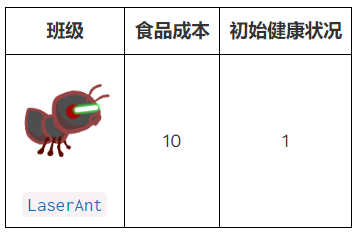

**LaserAnt**发射出强大的激光，摧毁所有胆敢挡在其道路上的东西。
所有类型的蜜蜂和蚂蚁都有被激光蚂蚁伤害的危险。
当激光蚁采取行动时，它会伤害在它所在位置的所有昆虫(不包括它自己，但如果它有容器的话，包括它的容器)和它前面的地方，不包括蜂巢。

如果是这样的话，LaserAnt的力量就太强大了，我们无法控制LaserAnt的基础伤害为2。
但是，LaserAnt的激光器有一些怪癖。激光每离开LaserAnt所在的位置，就会被削弱0.25个百分点。
此外，LaserAnt的电池有限。每次激光蚁实际伤害一只昆虫，其激光的总伤害降低0.0625(1/16)。
如果激光蚁的伤害因为这些限制而变为负值，那么它的伤害就变为0。

> 在一个回合中物品被破坏的确切顺序是不明确的。

为了完成这个终极蚂蚁的实现，通读类LaserAnt，适当设置类属性，实现以下两个功能：
1.inserts_in_front是一个实例方法，由action方法调用，它返回一个字典，其中每个键是一个Insect，
每个对应的值是该Insect到LaserAnt的距离(以位置为单位)。
字典应包括在同一位置或在LaserAnt前面的所有昆虫，不包括LaserAnt本身。

2.calculate_damage是一个实例方法，它接受距离，即昆虫离LaserAnt实例的距离。它返回了LaserAnt实例应该受到的伤害:

3.昆虫离LaserAnt实例的距离为distance。

4.这个LaserAnt已经损坏的昆虫的数量，存储在insects_shot属性中。

除了实现上述方法之外，您可能还需要根据LaserAnt需要修改、添加或使用类中的类或实例属性。

> 注意：此问题尚未解锁测试。

您可以运行提供的测试，但它并不引人注目：
```python
python ok -q optional2
```

## **项目提交**

同时，运行整个自动评分器，看看是否有任何测试未通过：
```python
python ok
```

您还可以查看项目每个部分的分数，包括其他学习分问题：
```python
python ok --score
```

**您现在已经完成了该项目！**如果您还没有，您应该尝试玩这个游戏！
```python
python gui.py [-h] [-d DIFFICULTY] [-w] [--food FOOD]
```