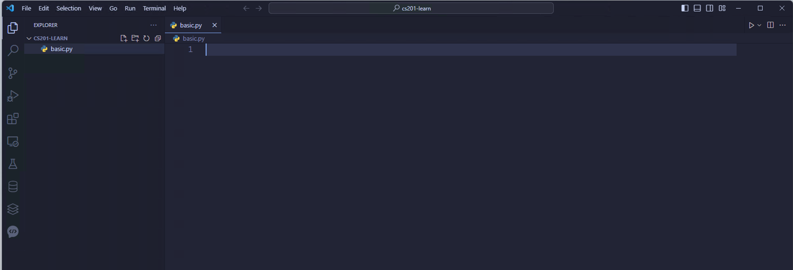
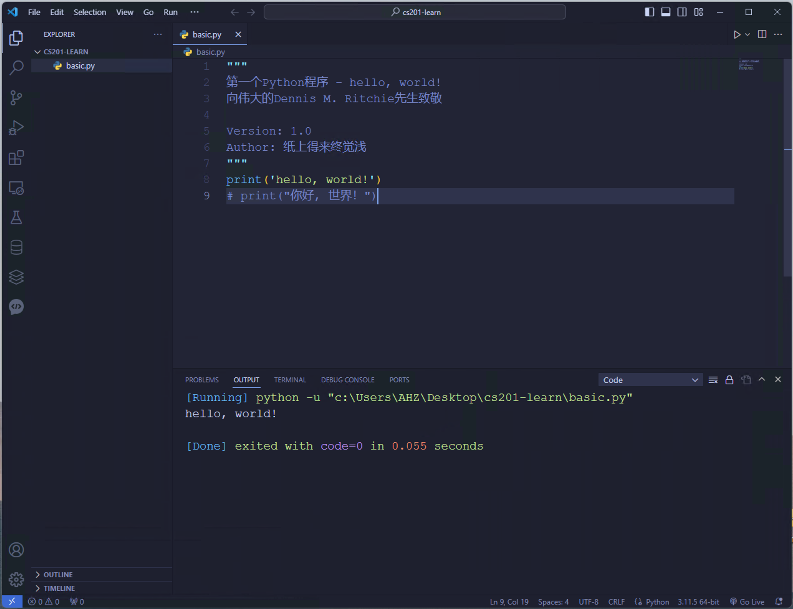
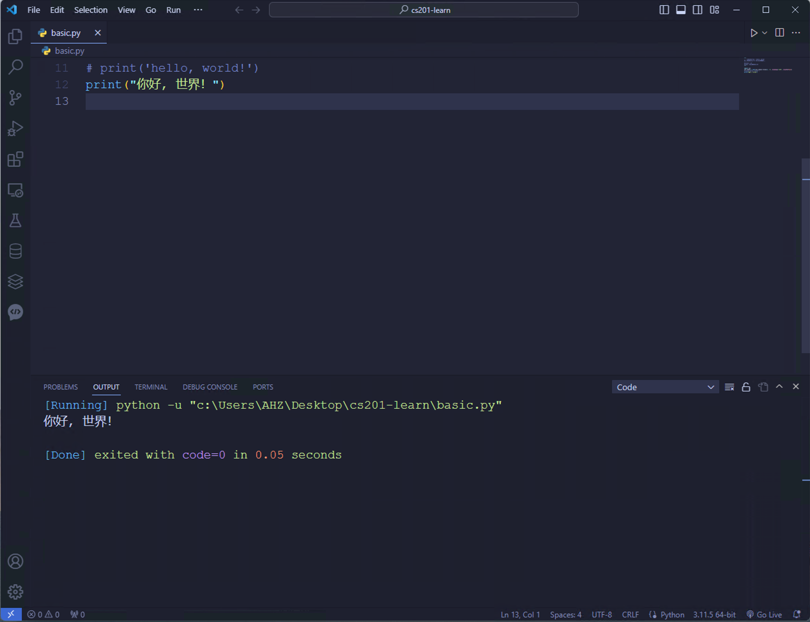

# Python 基础

:::caution 必读

本课程网站内容请仔细阅读后再进行实操。因未仔细阅读内容，出现任何错误后果自负（逃～～～逃～～～逃

**所有的代码请不要复制粘贴，请手敲每一行代码。复制粘贴不会让你动脑子，而手敲每一个行代码会让你自然而然地去动脑子会想每一行代码的含义和原理。所有的操作都需要自己动手，而不是立马就去问别人，只有自己动过脑子了才能学好。**

:::

新建一个 `cs201-learn`的文件夹，用 VS Code 打开该文件夹，然后新建一个名字叫做 `basic.py` 的 Python 源代码文件。*具体如何打开文件夹，并且新建一个文件，请仔细阅读本网站提供的教程 [VS Code 搭建 Python 开发环境](./development/vscode.md)*



:::danger 路径和文件名不要出现中文

强烈建议不要再 Python 代码所在的文件路径中出现中文，例如 `c:\Users\AHZ\Desktop\张三\cs201-learn\basic.py`。
或者 Python 源代码文件名字为中文，例如 `基础.py`。原因是使用中文有可能会造成莫名其妙的未知问题。

:::

输入如下代码：

```python
"""
第一个Python程序 - hello, world!
向伟大的Dennis M. Ritchie先生致敬

Version: 1.0
Author: 纸上得来终觉浅
"""
print('hello, world!')
# print("你好, 世界！")
```

点击 VS Code 中的运行按钮，便可在VS Code 提供的终端窗口中看到如下内容：



## 代码注释

注释是编程语言的一个重要组成部分，用于在源代码中解释代码的作用从而增强程序的可读性和可维护性，当然也可以将源代码中不需要参与运行的代码段通过注释来去掉，这一点在调试程序的时候经常用到。注释在随源代码进入预处理器或编译时会被移除，不会在目标代码中保留也不会影响程序的执行结果。

1. 单行注释 - 以#和空格开头的部分
2. 多行注释 - 三个引号开头，三个引号结尾

将`basic.py`中的代码更改成如下内容：

```python
"""
第一个Python程序 - hello, world!
向伟大的Dennis M. Ritchie先生致敬

Version: 1.0
Author: 纸上得来终觉浅
"""
# print('hello, world!')
print("你好, 世界！")
```

点击 VS Code 中的运行按钮，便可在VS Code 提供的终端窗口中看到如下内容：

