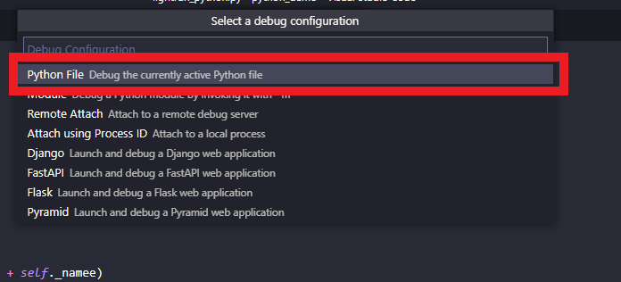
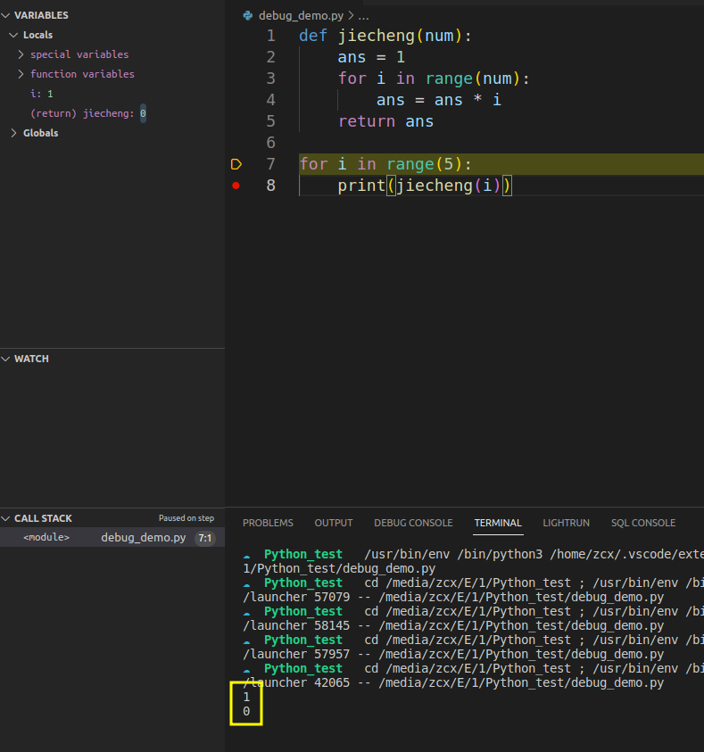
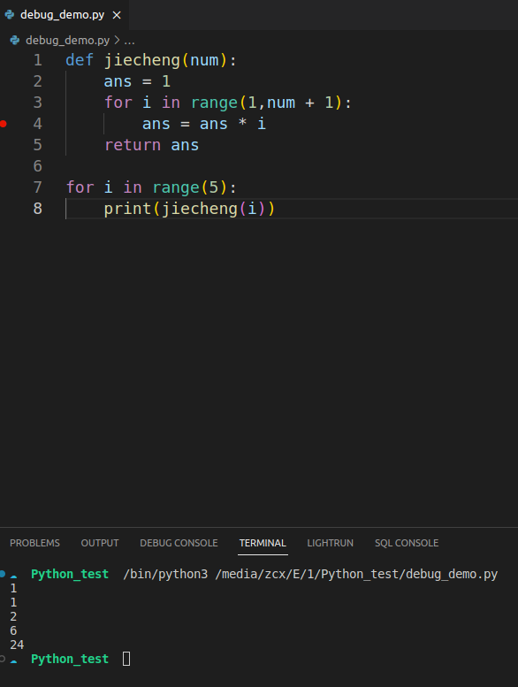

# VS Code Debug Python

:::caution 必读

本课程网站内容请仔细阅读后再进行实操。因未仔细阅读内容，出现任何错误后果自负（逃～～～逃～～～逃

**所有的代码请不要复制粘贴，请手敲每一行代码。复制粘贴不会让你动脑子，而手敲每一个行代码会让你自然而然地去动脑子会想每一行代码的含义和原理。所有的操作都需要自己动手，而不是立马就去问别人，只有自己动过脑子了才能学好。**

:::

```python
def jiecheng(num):
    ans = 1
    for i in range(num):
        ans = ans * i
    return ans

for i in range(5):
    print(jiechen(i))
```
## 调试当前文件

打开要调试的文件。在我们的例子中，它是带有上面代码示例的文件。当您将鼠标悬停在行号的左侧时，会出现一个褪色的红点。如果你点击这个点，它会设置一个断点。

断点是代码中的一个点，程序的执行将在此处暂时停止，以便可以检查程序的状态。断点有助于调试目的，因为它们允许程序员检查变量的值并查看程序在该点的执行情况。
当您第一次单击“运行和调试”时，您将获得选择调试配置的选项。对于本教程，选择Python 文件。



当您单击位于VARIABLES(变量)面板左上角的播放按钮时，调试器将运行代码并在断点处停止。


调试工具栏也将在此时可用。调试工具栏包含的按钮可让您前进、后退以及根据您当前在断点中的位置跳转到代码的不同部分。关于您的代码的元数据也将出现在VARIABLES(变量)面板中，您可以在其中观察和监视局部变量和全局变量的更改。

以下是工具栏中每个图标功能的简要说明：

* __继续(F5)__ – 这将越过断点并继续执行程序的其余部分，直到遇到下一个断点。

* __Step over (F10)__ – 这将使调试器进入下一行。

* __进入 (F11)__ – 这将使调试器进入以下函数。

* __退出 (F12)__ – 这将使调试器退出函数并进入下一步。

* __重新启动 (Ctrl+shift+F5)__ – 重新启动整个调试器。

* __停止 (shift+F5)__ – 停止调试过程并退出。

点击右上角的小箭头，点击Debug Python File即可开始调试

让我们运行我们的调试器，我们看到 'jiechen' 这个函数不存在。


发现原因为jiechen这个函数没有定义,为拼写错误


正常拼写后再次调试



出现错误，1的阶乘为0。

设置断点，继续调试


发现此时的i为0，因为range(num)会生成是从0到num-1，所以设置为range(1,num+1)使得其生成1到num



结果输出正确

## 推选阅读资料
[GDB debug](https://heather.cs.ucdavis.edu/~matloff/UnixAndC/CLanguage/Debug.html)
