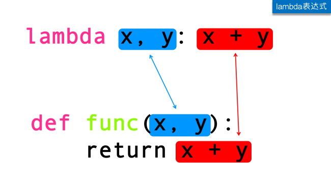

# lambda表达式和高阶函数

:::caution 必读

本课程网站内容请仔细阅读后再进行实操。因未仔细阅读内容，出现任何错误后果自负（逃～～～逃～～～逃

**所有的代码请不要复制粘贴，请手敲每一行代码。复制粘贴不会让你动脑子，而手敲每一个行代码会让你自然而然地去动脑子会想每一行代码的含义和原理。所有的操作都需要自己动手，而不是立马就去问别人，只有自己动过脑子了才能学好。**

:::

## lambda 表达式

Python Lambda 表达式是一个匿名函数，Lambda 表达式基于数学中的 lambda 演算得名，直接对应于其中的 lambda 抽象，是一个匿名函数，即没有函数名的函数。

### 语法

简单地说，lambda 表达式就像任何普通的 Python 函数一样，只不过它在定义时没有名称，并且包含在一行代码中。

```python
lambda argument(s): expression
```

从上述语法可以看到我们给 lambda 表达式提供一个值（参数），然后提供操作（表达式）。关键字 `lambda` 必须放在第一位， `:`分隔参数和表达式

如下是一个 lambda 表达式和普通函数的案例，两个代码实现的功能一样。

```python
#Normal Python function
def a_name(x):
    return x + x

# Lambda express
lambda x: x + x
```



### 赋值

既然 lambda 作为一种表达式，因此我们可以将 lambda 表达式赋值给一个变量，通过这个变量间接调用该lambda表达式。

在`cs201-learn`的文件夹，用 VS Code 新建一个名字叫做 `lambda.py` 的 Python 源代码文件。
输入如下代码，并运行

```python
# -*- coding: utf-8 -*-

if __name__ == '__main__':
  add = lambda x, y : x + y
  print(add(2, 3))
```

:::note

一些程序员发现使用 Lambda 表达式作为匿名函数非常简短和直接，但是复合的 Lambda 表达式非常难以辨认，尽管它们很简洁。下面的定义是正确的，但是许多程序员不能很快地理解它：

```python
compose = lambda f,g: lambda x: f(g(x))
```

通常，Python 的代码风格倾向于显式的 `def` 语句而不是 `lambda` 表达式，但是允许它们在简单函数作为参数或返回值的情况下使用。
这种风格规范不是准则，你可以想怎么写就怎么写。但在你编写程序时需要考虑某一天可能会阅读你的程序的人们，如果你的程序更易于理解，那就帮了别人的忙了。

算法和程序设计技术的先驱，计算机排版系统TeX和字型设计系统Metafont的发明者高德纳（Donald Ervin Knuth）曾经说过：“Programs are meant to be ready by humans and only icidentally for computers to execute.”
所以作为一名合格的程序员，请记住“**代码是用来让人读的，只是顺便让机器执行而已**”

:::

## 高阶函数

### 什么是高阶函数？

只要满足下面的任意一个条件就是高阶函数：

1. 一个函数的函数名作为参数传给另外一个函数
2. 一个函数返回值（return）为另外一个函数（返回为自己，则为递归）

#### 函数作为参数

在`cs201-learn`的文件夹，用 VS Code 新建一个名字叫做 `higher_order_function01.py` 的 Python 源代码文件。
输入如下代码，并运行

```python
# -*- coding: utf-8 -*-

def func():
    print("定义一个普通函数")
    
def high_level(func):
    print("定义一个高阶函数")
    # 在函数内部，通过传入的函数参数调用
    func()
    
if __name__ == "__main__":    
    high_level(func)
```

#### 函数作为返回值

在`cs201-learn`的文件夹，用 VS Code 新建一个名字叫做 `higher_order_function02.py` 的 Python 源代码文件。
输入如下代码，并运行

```python
# -*- coding: utf-8 -*-

def func():
    print("定义一个普通函数")
    
def high_level(func):
    print("定义一个高阶函数")
    return func
    #  return func() 这个是直接返回函数调用，递归函数就是如此

if __name__ == "__main__":    
    res = high_level(func)
    # 高阶函数返回函数之后在调用func函数
    res()
```

### Python内置高阶函数

#### `filter` 函数

`filter()`把一个可迭代对象中的元素做过滤操作，如果func返回值为True则留下，否则过滤掉。


```python
# -*- coding: utf-8 -*-

def not_odd(num):
    return num % 2 == 0

if __name__ == "__main__":
    # 过滤奇数
    new_lst = filter(not_odd, [1, 2, 3, 4, 5, 6, 7, 8, 9, 10])
    print(list(new_lst))

```


#### `map` 函数


#### `reduce` 函数


