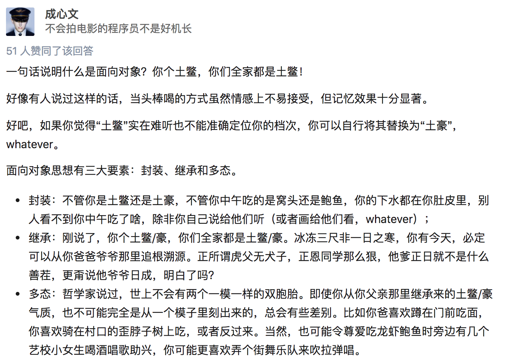

# 面向对象编程基础

:::caution 必读

本课程网站内容请仔细阅读后再进行实操。因未仔细阅读内容，出现任何错误后果自负（逃～～～逃～～～逃

**所有的代码请不要复制粘贴，请手敲每一行代码。复制粘贴不会让你动脑子，而手敲每一个行代码会让你自然而然地去动脑子会想每一行代码的含义和原理。所有的操作都需要自己动手，而不是立马就去问别人，只有自己动过脑子了才能学好。**

:::

活在当下的程序员应该都听过"面向对象编程"一词，也经常有人问能不能用一句话解释下什么是"面向对象编程"，我们先来看看比较正式的说法。

"把一组数据结构和处理它们的方法组成对象（object），把相同行为的对象归纳为类（class），通过类的封装（encapsulation）隐藏内部细节，通过继承（inheritance）实现类的特化（specialization）和泛化（generalization），通过多态（polymorphism）实现基于对象类型的动态分派。"

这样一说是不是更不明白了。所以我们还是看看更通俗易懂的说法



## 类和对象

简单的说，类是对象的蓝图和模板，而对象是类的实例。这个解释虽然有点像用概念在解释概念，但是从这句话我们至少可以看出，类是抽象的概念，而对象是具体的东西。在面向对象编程的世界中，一切皆为对象，对象都有属性和行为，每个对象都是独一无二的，而且对象一定属于某个类（型）。当我们把一大堆拥有共同特征的对象的静态特征（属性）和动态特征（行为）都抽取出来后，就可以定义出一个叫做“类”的东西。

## 定义类

在Python中可以使用class关键字定义类，然后在类中通过之前学习过的函数来定义方法，这样就可以将对象的动态特征描述出来，定义类的一般语法如下所示。

```python
class <className>:

    <class_attribute_name> = <value>

    def __init__(self,<param1>, <param2>, ...):
        self.<attr1> = <param1>
        self.<attr2> = <param2>
        .
        .
        .
        # As many attributes as needed
    
   def <method_name>(self, <param1>, ...):
       <code>
       
   # As many methods as needed
```
:::tip
> self是类的实例(用类创建的对象)的引用。
> 写在类中的函数，我们通常称之为（对象的）方法，这些方法就是对象可以接收的消息。
:::

在`cs201-learn`的文件夹，用 VS Code 新建一个名字叫做 `class01.py` 的 Python 源代码文件。
输入如下代码，并运行。

```python
# -*- coding: utf-8 -*-

from math import sqrt

class Point(object):

    def __init__(self, x=0, y=0):
        """初始化方法
        
        :param x: 横坐标
        :param y: 纵坐标
        """
        self.x = x
        self.y = y

    def move_to(self, x, y):
        """移动到指定位置
        
        :param x: 新的横坐标
        "param y: 新的纵坐标
        """
        self.x = x
        self.y = y

    def move_by(self, dx, dy):
        """移动指定的增量
        
        :param dx: 横坐标的增量
        "param dy: 纵坐标的增量
        """
        self.x += dx
        self.y += dy

    def distance_to(self, other):
        """计算与另一个点的距离
        
        :param other: 另一个点
        """
        dx = self.x - other.x
        dy = self.y - other.y
        return sqrt(dx ** 2 + dy ** 2)

    def __str__(self):
        return '(%s, %s)' % (str(self.x), str(self.y))

if __name__ == '__main__':
    p1 = Point(3, 5)
    p2 = Point()
    print(p1)
    print(p2)
    p2.move_by(-1, 2)
    print(p2)
    print(p1.distance_to(p2))

```

如你所见，类可以有很多不同的元素，让我们来分析一下它们的细节：

###  类的头部
类定义的第一行是class关键字和类名：
```python
class Dog:
```

```python
class House:
```

```python
class Ball:
```

:::note
 如果一个类继承了另外一个类的属性和方法，我们会在括号中看到该类的名称：

```python
class Poodle(Dog):
```

```python
class Truck(Vehicle):
```

```python
class Mom(FamilyMember):
```
:::
Python 中, 类名用大驼峰（也称为 Pascal Case），名称中的每个一个单词都是以大写字母开头。例如：FamilyMember

###  __init__和实例属性

接下来，我们将使用类在 Python 中创建对象，就像我们根据图纸建造真正的房屋一样。

对象中的属性来自于我们在类中定义，而这些属性通常是在__init__方法中被初始化，而__init__方法会在创建类的实例时被执行。

这是一般语法：

```python
def __init__(self, <parameter1>, <parameter2>, ...):
        self.<attribute1> = <parameter1>  # Instance attribute
        self.<attribute2> = <parameter2>  # Instance attribute
        .
        .
        .
        # As many instance attributes as needed
```
我们可以根据需要来给类指定尽可能多的属性。

Dog类的一个__init__方法例子：

```python
class Dog:

    def __init__(self, name, age):
        self.name = name
        self.age = age
```
:::tip
 注意名称``__init__``中的前后的双下划线
:::

###  如何创建类的实例

要创建Dog类的实例，我们需要指定 name 和 age 属性。

```python
my_dog = Dog("Nora", 10)
```

很好。现在我们已经准备好了一个可以在代码中使用的 Dog 实例了。

有些类，可以不需要任何参数来创建实例。 这种情况我们只需要一个空括号，例如：

```python
class Circle:

    def __init__(self):
        self.radius = 1
```

创建实例：

```python
my_circle = Circle()
```

:::tip
  self像是一个“幕后”的参数，即使我们在方法的定义中看到它，但你传参数时可以不用考虑它。
:::

### 默认参数

我们可以为类的属性指定默认值，但如果使用者想自己赋值，也是可以的。

这种情况下，我们可以在参数列表中写上形如：< attribute >=< value >

例如：
```python
class Circle:

    def __init__(self, radius=1):
        self.radius = radius
```
现在我们创建Circle实例，你可以通过忽略 radius 参数使用它的默认值，也可以传入一个自己的值：

```python
# Default value
my_circle1 = Circle()

# Customized value
my_circle2 = Circle(5)
```

### 如何获取与更新实例的属性

访问实例属性，可以用下面的语法：

```python
<object_variable>.<attribute>
```

更新实例的属性，我们可以用下面的语法：
```python
<object_variable>.<attribute> = <new_value>
```

在`cs201-learn`的文件夹，用 VS Code 新建一个名字叫做 `class02.py` 的 Python 源代码文件。
输入如下代码，并运行。

```python
# -*- coding: utf-8 -*-

class Dog:

    def __init__(self, name, age):
        self.name = name
        self.age = age
      
my_dog = Dog("Nora", 10)

print(my_dog.name)
print(my_dog.age)
my_dog.name = "Norita"
print(my_dog.name)
```

### 如何定义和使用方法
方法用于表示类实例的功能。

:::tip
 如果我们在实例方法的定义中写上self.< attribute >，那么实例方法就可以调用实例属性。
:::

下面是定义方法的基本语法，这些方法一般定义在__init__方法后面：

```python
class <ClassName>:

    # Class attributes

    # __init__

    def <method_name>(self, <param1>, ...):
        <code>
```
这些实例方法可能有 0 个、1 个或多个参数（**就像函数！**），但self必须是第一个参数。

要调用这个方法，我们用下面的语法：

```python
<object_variable>.<method>(<arguments>)
```

在`cs201-learn`的文件夹，用 VS Code 新建一个名字叫做 `class03.py` 的 Python 源代码文件。
输入如下代码，并运行。

```python
# -*- coding: utf-8 -*-

class Dog:

    def __init__(self, name, age):
        self.name = name
        self.age = age

    def bark(self):
        print(f"woof-woof. I'm {self.name}")

if __name__ == "__main__":
    my_dog = Dog("Nora", 10)
    print(my_dog.bark())
```

在`cs201-learn`的文件夹，用 VS Code 新建一个名字叫做 `class04.py` 的 Python 源代码文件。
输入如下代码，并运行。
```python
# -*- coding: utf-8 -*-

class Player:

    def __init__(self, name):
        self.name = name
        self.speed = 50

    def increment_speed(self, value):
        self.speed += value

if __name__ == "__main__":
    my_player = Player("Nora")
    print(my_player.speed)
    my_player.increment_speed(5)
    print(my_player.speed)
```

:::tip
要添加更多参数，只需要将多个参数用逗号分隔。建议在每个逗号后面加一个空格。
:::

### 访问可见性问题

对于上面的代码，有C++、Java、C#等编程经验的程序员可能会问，我们给Student对象绑定的name和age属性到底具有怎样的访问权限（也称为可见性）。因为在很多面向对象编程语言中，我们通常会将对象的属性设置为私有的（private）或受保护的（protected），简单的说就是不允许外界访问，而对象的方法通常都是公开的（public），因为公开的方法就是对象能够接受的消息。在Python中，属性和方法的访问权限只有两种，也就是公开的和私有的，如果希望属性是私有的，在给属性命名时可以用两个下划线作为开头，下面的代码可以验证这一点。

在`cs201-learn`的文件夹，用 VS Code 新建一个名字叫做 `class05.py` 的 Python 源代码文件。
输入如下代码，并运行。

```python
# -*- coding: utf-8 -*-

class Test:

    def __init__(self, foo):
        self.__foo = foo

    def __bar(self):
        print(self.__foo)
        print('__bar')

if __name__ == "__main__":
    test = Test('hello')
    # AttributeError: 'Test' object has no attribute '__bar'
    test.__bar()
    # AttributeError: 'Test' object has no attribute '__foo'
    print(test.__foo)
```