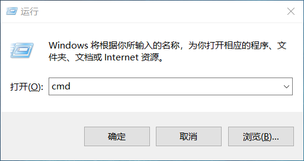
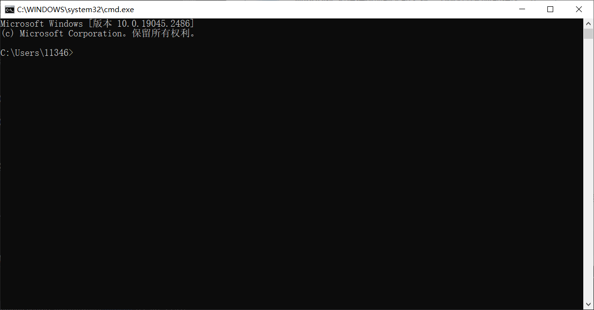
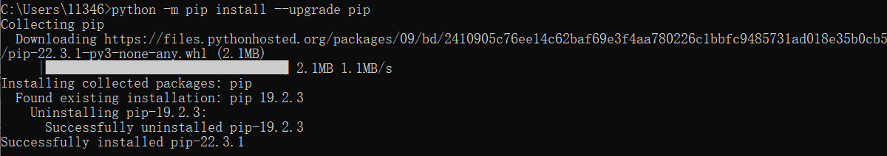
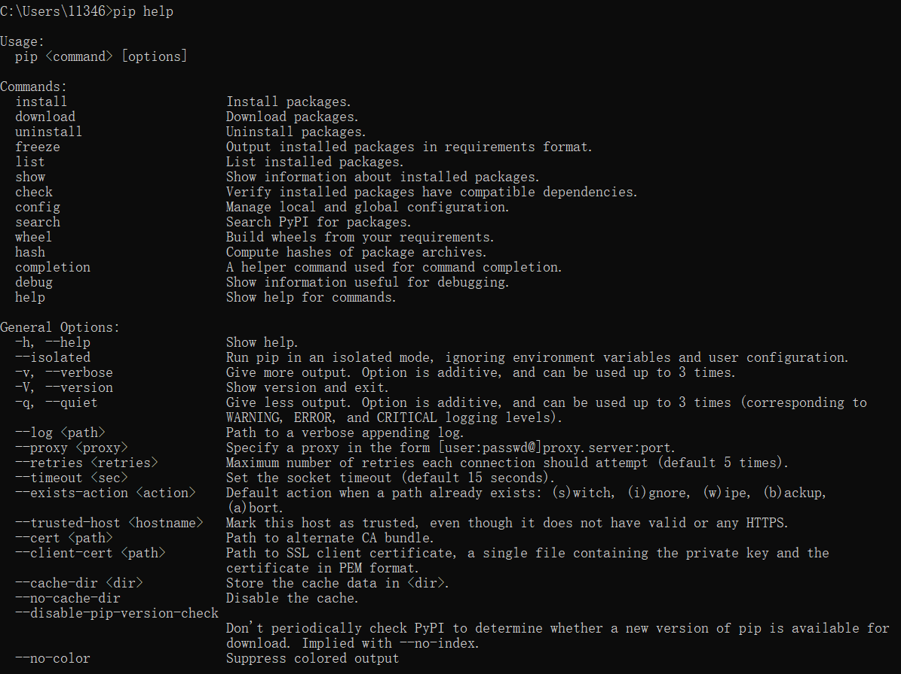
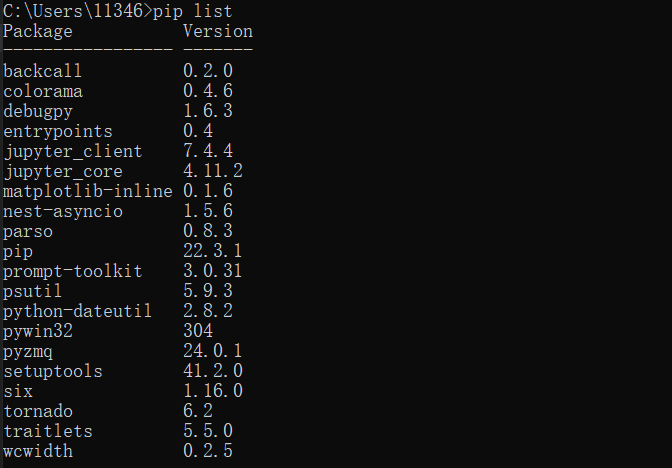

# pip包管理

:::caution 必读

本课程网站内容请仔细阅读后再进行实操。因未仔细阅读内容，出现任何错误后果自负（逃～～～逃～～～逃

**所有的代码请不要复制粘贴，请手敲每一行代码。复制粘贴不会让你动脑子，而手敲每一个行代码会让你自然而然地去动脑子会想每一行代码的含义和原理。所有的操作都需要自己动手，而不是立马就去问别人，只有自己动过脑子了才能学好。**

:::

## pip简介

pip是Python标准库管理器，是用来安装不同类库的工具，可以对Python包进行查找、下载、安装和卸载等功能。

pip提供了对Python包快捷有效的管理，当我们的Python版本在2.7.9+或3.4及以上版本都自带 pip 工具。在此简单地介绍一下pip的部分相关指令.

## 为什么要使用pip

软件开发工作，一般情况下都不会是完全全是自己实现，还要依赖别人的代码。那就自然引入一个问题，如何引入别的代码？

别人开发包，我们直接复用别人的代码不就好了吗。但是这有一些问题，别人提供的代码中的定义万一和我的代码有很多冲突怎么办，我能拿过来就用吗？或许修修补补还是可以实现的。但如果我们并不了解别人代码，那就非常困难了，成本太高，或许还会改出 bug。于是，包就出现了，它通过一些约定俗成的规则防止一些问题发生，比如名称冲突，简化我们的工作。我们要使用别人的代码，只要 import 即可。

语言一般只提供最核心的能力，其他功能都会通过包扩展，包一般可分两类，标准库和第三方库，**标准库即官方提供给的**，比如 Python 中的 math、random、functools 等包，**第三方包是由第三方个人或组织开发的包**，比如流行的数据分析处理库 numpy 和 pandas，web 领域的三个框架 django、flask 和 tornado。

### 为什么要通过 pip 下载？

无论是标准库还是第三方库，其实都是某些人开发出来，提供给其他需要的人使用。标准库在安装好 Python 就有了，标准库的包获取比较简单。

### 网络上别人分享的第三方包怎么处理？

它是需要我们自己下载的。通常会有一个中央仓库用于别人发布自己的包，如 Python 的 pypi 源，如果下载速度慢，通常还可以设置国内镜像加速。

怎么从这些源下载包？纯粹手动 ftp、http 下载吗？但下载好之后，还会要处理诸如怎么找到包，如何把包移动到合适的路径等，万一这个包还有依赖其他包怎么办？再去手动下载其他包？万一是个大项目，通常会依赖很多的包，并且还会牵涉到版本管理，问题太多了。

模块/包管理机制产生了！pip 就是 Python 的包管理工具。现代的这些高级语言，基本都有一套模块/包管理机制，Python 的 pip，Java 的maven，Go 的 go module，PHP 的 composer，nodeJS 的 npm 等。前面提到的那些问题，工具帮你解决，真的是一站式解决方案。

## 如何进行pip包管理

首先本页面的指令用到cmd命令提示符，我们使用win+R打开运行，输入cmd后按回车来进入界面





### 使用中国镜像加速

当我们进行pip下载时，使用外国的源会导致下载速度很慢，所以在使用之前我们首先要学会如何使用中国大陆镜像对下载进行加速。

首先我们需要升级一下pip包，保证他的版本在10.0.0以上，请打开终端进行实操。

```bash
python -m pip install --upgrade pip
```



然后更换中国源（这里我们采用了清华镜像源）,请打开终端进行实操。

```bash
pip config set global.index-url https://pypi.tuna.tsinghua.edu.cn/simple
```


当然，如果使用示例中的清华源依然下载卡顿，我们还可以选择别的中国源：

```txt
清华大学：https://pypi.tuna.tsinghua.edu.cn/simple
中国科技大学：https://pypi.mirrors.ustc.edu.cn/simple
北京大学：https://mirrors.pku.edu.cn/pypi/web/simple
南京大学：https://mirror.nju.edu.cn/pypi/web/simple
上海交通大学：https://mirror.sjtu.edu.cn/pypi/web/simple
西安交通大学：https://mirrors.xjtu.edu.cn/pypi/simple
南方科技大学：https://mirrors.sustech.edu.cn/pypi/simple
阿里云：https://mirrors.aliyun.com/pypi/simple
腾讯云：https://mirrors.cloud.tencent.com/pypi/simple
华为云：https://repo.huaweicloud.com/repository/pypi/simple
```

### 查看pip命令语句（show help）

```bash
pip help
pip --h
```



### 下载指定的Python包

```bash
pip install package_name
```

请在终端里面输入如下命令，安装 `Numpy, Matplotlib, Scipy, FastAPI`这几个库，我们提供其中的一个案例，请举一反三安装其他的库。

```bash
pip install numpy
```
:::tip 小提示

各个第三方软件包官方网站基本都有如何使用pip安装软件包本身的教程，请仔细阅读官方网站。
- Numpy: https://numpy.org/install/
- Matplotlib: https://matplotlib.org/stable/users/installing/index.html
- Scipy: https://scipy.org/install/
- FastAPI: https://fastapi.tiangolo.com/tutorial/#install-fastapi

:::

也可在被安装包的名称后加上版本号以安装指定版本的Python包，如pip install package_name==1.2.3。

### 卸载指定的Python包

```bash
pip uninstall package_name
```

指定版本同上

### 查看已安装的库

```bash
pip list
```



### 查看当前可升级的库

```bash
pip list -o
```


### 查看pip版本（show version and exit）

```bash
pip --version
```


### 升级Python包

```bash
pip install --upgrade package_name
pip install --U package_name
```

例如升级pip包


对pip 相关知识感兴趣的同学，可查询[pip官网](https://pypi.org/project/pip/)
