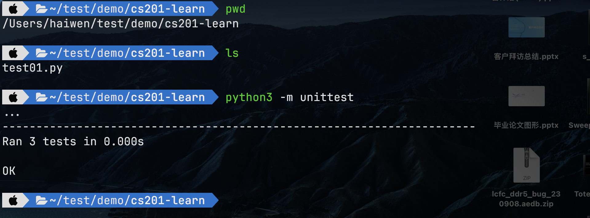

# 单元测试

:::caution 必读

本课程网站内容请仔细阅读后再进行实操。因未仔细阅读内容，出现任何错误后果自负（逃～～～逃～～～逃

**所有的代码请不要复制粘贴，请手敲每一行代码。复制粘贴不会让你动脑子，而手敲每一个行代码会让你自然而然地去动脑子会想每一行代码的含义和原理。所有的操作都需要自己动手，而不是立马就去问别人，只有自己动过脑子了才能学好。**

:::

单元测试(Unit Testing)是根据特定的输入数据，针对程序模块输出的正确性进行验证的工作。这些程序模块包括，
- 单个程序
- 函数
- 类
- ……

我们在实现一个程序时不能仅仅实现功能方面的端到端调试，仅仅是能够从数据输入到数据输出能够实现贯通是远远不够的。还要保证每个最小模块能够按照对应的输入能够实现正确的输出，这样我们就需要设定一些测试数据来验证程序的正确性。

:::tip 至理名言
**未经测试的代码就是无效代码**
:::

:::note 测试驱动开发 (TDD：Test-Driven Development)
在实际的软件开发过程中，常常会使用的测试驱动开发（TDD）的模式。

测试驱动开发的基本思想就是在开发功能代码之前，先编写测试代码，然后只编写使测试通过的功能代码，从而以测试来驱动整个开发过程的进行。这有助于编写简洁可用和高质量的代码，有很高的灵活性和健壮性，能快速响应变化，并加速开发过程。
测试驱动开发的基本过程如下：

1. 快速新增一个测试
2. 运行所有的测试（有时候只需要运行一个或一部分），发现新增的测试不能通过
3. 做一些小小的改动，尽快地让测试程序可运行，为此可以在程序中使用一些不合情理的方法
4. 运行所有的测试，并且全部通过
5. 重构代码，以消除重复设计，优化设计结构
:::

## 基本案例


在`cs201-learn`的文件夹，用 VS Code 新建一个名字叫做 `test01.py` 的 Python 源代码文件，输入如下代码。

```python
# -*- coding: utf-8 -*-

import unittest

# 用于测试的类
class TestClass(object):
    def add(self, x, y):
        return x + y

    def is_string(self, s):
        return type(s) == str

    def raise_error(self):
        raise KeyError("test.")

# 测试用例
class Case(unittest.TestCase):
    def setUp(self):
        self.test_class = TestClass()

    def test_add_5_5(self):
        self.assertEqual(self.test_class.add(5, 5), 10)

    def test_bool_value(self):
        self.assertTrue(self.test_class.is_string("hello world!"))

    def test_raise(self):
        self.assertRaises(KeyError, self.test_class.raise_error)

    def tearDown(self):
        del self.test_class

if __name__ == "__main__":
    unittest.main()
```

打开命令行工具，进到 `cs201-learn` 文件夹，输入如下命令：

```bash
python3 -m unittest
```
输出结果如下：



可以看出，共执行了3个测试，没有出现异常现象。

上述这个例子就概括了unittest的基本使用，下面我们来详细剖析一下关键点。
首先，我在这里实现了一个用于测试的类TestClass，它包含3个方法，内容如下：

- add：输入数据为5，5，如果功能正确返回值是10；
- is_string：输入数是'hello world!'，如果功能正确返回的是True;
- raise_error：直接抛出异常；
  
明确了我们要测试的方法和重点，接下来就是写测试用例，也就是上述代码中 `Case` 类中的代码。

`unittest`提供一个基类`TestCase`，如果我们要编写一个测试用例，就需要继承这个抽象基类，这样当我们运行测试程序时它会自动的运行这些测试用例。
测试方法的名称
测试方法要以`test`开头，这样测试程序能够自动找到要运行的方法，在上述例子中包含3个测试方法，
- test_add_5_5
- test_bool_value
- test_raise

`setUp`和`tearDown`有点类似于C++中的构造方法和析构方法，通俗的来讲，它们分别用于处理测试开始前和完成后要执行的命令。
当一个测试用例开始之前，会先进入`setUp`方法，当测试结束后会进入`tearDown`方法。
在上面测试用例中，我在`setUp`中用于实例化`TestClass`这个要被测试的类，然后在`tearDown`中清理对象。

在上述测试用例中也用到一些用于断言的方法，它们来自于`unittest`基类。

- `assertEqual()`来检查预期的输出；
- 调用`assertTrue()`或`assertFalse()`来验证一个条件；
- 调用`assertRaises()`来验证抛出了一个特定的异常。

更多的断言方法如下所示：

| 断言方法 | 检测的类型 |
| ----- | --------- | 
| assertEqual(a, b) | a == b |
| assertNotEqual(a, b) | a ！= b |
| assertTrue(x) | bool(x) is True |
| assertFalse(x) | bool(x) is False |
| assertIs(a, b) | a is b |
| assertIsNot(a, b) | a is not b |
| assertIsNone(x) | x is None |
| assertIsNotNone(x) | x is not None |
| assertIn(a, b) | a in b |
| assertNotIn(a, b) | a not in b |
| assertIsInstance(a, b) | isinstance(a, b) |
| assertNotIsInstance(a, b) | not isinstance(a, b) |
