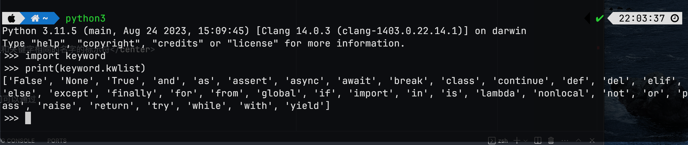

# 变量和类型

:::caution 必读

本课程网站内容请仔细阅读后再进行实操。因未仔细阅读内容，出现任何错误后果自负（逃～～～逃～～～逃

**所有的代码请不要复制粘贴，请手敲每一行代码。复制粘贴不会让你动脑子，而手敲每一个行代码会让你自然而然地去动脑子会想每一行代码的含义和原理。所有的操作都需要自己动手，而不是立马就去问别人，只有自己动过脑子了才能学好。**

:::

在程序设计中，变量是一种存储数据的载体。计算机中的变量是实际存在的数据或者说是存储器中存储数据的一块内存空间，变量的值可以被读取和修改，这是所有计算和控制的基础。计算机能处理的数据有很多种类型，除了数值之外还可以处理文本、图形、音频、视频等各种各样的数据，那么不同的数据就需要定义不同的存储类型。Python中的数据类型很多，而且也允许我们自定义新的数据类型（这一点在后面会讲到），我们先介绍几种常用的数据类型。

- 整型（int）：Python中可以处理任意大小的整数，而且支持二进制（如0b100，换算成十进制是4）、八进制（如0o100，换算成十进制是64）、十进制（100）和十六进制（0x100，换算成十进制是256）的表示法。
- 浮点型 (float)：浮点数也就是小数，之所以称为浮点数，是因为按照科学记数法表示时，一个浮点数的小数点位置是可变的，浮点数除了数学写法（如123.456）之外还支持科学计数法（如1.23456e2）。
- 字符串型 (string)：字符串是以单引号或双引号括起来的任意文本，比如'hello'和"hello",字符串还有原始字符串表示法、字节字符串表示法、Unicode字符串表示法，而且可以书写成多行的形式（用三个单引号或三个双引号开头，三个单引号或三个双引号结尾）。
- 布尔型 (bool)：布尔值只有True、False两种值，要么是True，要么是False，在Python中，可以直接用True、False表示布尔值（请注意大小写），也可以通过布尔运算计算出来（例如3 < 5会产生布尔值True，而2 == 1会产生布尔值False）。
- 复数型 (complex)：形如3+5j，跟数学上的复数表示一样，唯一不同的是虚部的i换成了j。实际上，这个类型并不常用，大家了解一下就可以了。


在Python中，我们定义一个变量通常是创建一个变量并为这个变量赋值。变量赋值以后该变量才会被创建。

```py
<var_name> = <value>
```

例如

```py
number = 123
```

```py
name = "XiaoMing"
```

## 变量的命名

对于每个变量我们需要给它取一个名字，就如同我们每个人都有属于自己的响亮的名字一样。在Python中，变量命名需要遵循以下这些必须遵守硬性规则和强烈建议遵守的非硬性规则。

- 硬性规则：
  - 变量名由字母（广义的Unicode字符，不包括特殊字符）、数字和下划线构成，数字不能开头。
  - 大小写敏感（大写的a和小写的A是两个不同的变量）。
  - 不要跟关键字（有特殊含义的单词，后面会讲到）和系统保留字（如函数、模块等的名字）冲突。
- PEP 8要求：
  - 用小写字母拼写，多个单词用下划线连接。
  - 受保护的实例属性用单个下划线开头（后面会讲到）。
  - 私有的实例属性用两个下划线开头（后面会讲到）。
  - 
当然，作为一个专业的程序员，给变量（事实上应该是所有的标识符）命名时做到**见名知意**也是非常重要的。

:::note Python关键字

关键字是Python内部已经使用的标识符，具有特殊的功能和含义。

可以打开 Python REPL(交互式解释器)，输入如下代码：

```py
import keyword
print(keyword.kwlist)
```

便可在 Python REPL中看到 Python 的关键字


:::

在`cs201-learn`的文件夹，用 VS Code 新建一个名字叫做 `variable01.py` 的 Python 源代码文件。
输入如下代码，并运行

```python
# -*- coding: utf-8 -*-

"""
使用变量保存数据并进行加减乘除运算
"""
a = 321
b = 12
print(a + b)    # 333
print(a - b)    # 309
print(a * b)    # 3852
print(a / b)    # 26.75
```

在Python中可以使用`type`函数对变量的类型进行检查。程序设计中函数的概念跟数学上函数的概念是一致的，数学上的函数相信大家并不陌生，它包括了函数名、自变量和因变量。如果暂时不理解这个概念也不要紧，我们会在后续的章节中专门讲解函数的定义和使用。

在`cs201-learn`的文件夹，用 VS Code 新建一个名字叫做 `variable02.py` 的 Python 源代码文件。
输入如下代码，并运行。

```python
# -*- coding: utf-8 -*-

"""
使用type()检查变量的类型
"""
a = 100
b = 12.345
c = 1 + 5j
d = 'hello, world'
e = True
print(type(a))    # <class 'int'>
print(type(b))    # <class 'float'>
print(type(c))    # <class 'complex'>
print(type(d))    # <class 'str'>
print(type(e))    # <class 'bool'>
```

## 变量的输入

除了自己定义的变量外，我们可以通过 `input` 函数获取键盘输入的字符串。并且可以使用 Python 中内置的函数对变量进行类型转换。

- `int()`：将一个数值或字符串转换成整数，可以指定进制。
- `float()`：将一个字符串转换成浮点数。
- `str()`：将指定的对象转换成字符串形式，可以指定编码。
- `chr()`：将整数转换成该编码对应的字符串（一个字符）。
- `ord()`：将字符串（一个字符）转换成对应的编码（整数）。

在`cs201-learn`的文件夹，用 VS Code 新建一个名字叫做 `variable03.py` 的 Python 源代码文件。
输入如下代码，并运行。
  
```python
# -*- coding: utf-8 -*-

"""
使用input()函数获取键盘输入(字符串)
使用int()函数将输入的字符串转换成整数
"""
a_input = input('a = ')
b_input = input('b = ')
a = int(a_input)
b = int(b_input)
print(a+b)
```

## 变量的输出

在Python中通常使用print函数将信息输出到控制台，当我们希望输出文字信息的同时，一起输出数据，我们需要将输出格式化。

* 包含%的字符串，被成为格式化字符串
* %和不同的字符连用,不同类型的数据需要使用不同的格式化字符

|格式化字符串|含义|
|---|---|
|%s|字符串|
|%d|有符号十进制整数,%06d 表示输出的整数显示位数字,不足的地方使用0 补全|
|%f|浮点数,%.02f 表示小数点后只显示两位|
|%%|表示百分号（因为百分号代表了占位符，所以带占位符的字符串中要表示百分号必须写成%%）|

在`cs201-learn`的文件夹，用 VS Code 新建一个名字叫做 `variable04.py` 的 Python 源代码文件。
输入如下代码，并运行。

```python
# -*- coding: utf-8 -*-

"""
使用print()函数输出带占位符的字符串
"""
a = int(input('a = '))
b = int(input('b = '))
print('%d + %d = %d' % (a, b, a + b))
print('%d - %d = %d' % (a, b, a - b))
print('%d * %d = %d' % (a, b, a * b))
print('%d / %d = %f' % (a, b, a / b))
print('%d // %d = %d' % (a, b, a // b))
print('%d %% %d = %d' % (a, b, a % b))
print('%d ** %d = %d' % (a, b, a ** b))
```